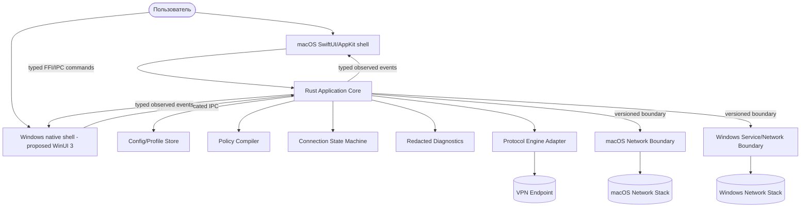

# NovaRay: текущая и целевая архитектура

Статус: переносимый Rust core с local-proxy lifecycle и изолированными macOS helper adapters.
Раздел 1 описывает текущие границы по коду; diagram раздела 3 описывает цель, не готовый VPN.

Порядок релизов: macOS Apple Silicon первым, Windows 11 x64 вторым, Android третьим.

## 1. Текущая архитектура

```text
Foreground CLI start / validate / status / pinned-releases
  -> ProxyService -> catalog/version/dialect/checksum checks
                  -> Xray or sing-box config -> preflight -> ProcessSupervisor
Rust core: config/schema/validators, VLESS parser, matcher, typed lifecycle
Helper boundary: typed protocol, replay/admission and recording execution contracts
macOS isolated adapters: getpeereid, AuthorizationRightGet (read-only)
System routing path: RouteManager remains no-op; no production helper listener
```

[`src/cli.rs`](../src/cli.rs) удерживает foreground `start` до остановки и делегирует работу
[`ProxyService`](../src/engine.rs); [`ProcessSupervisor`](../src/core.rs) управляет настоящим child
process, readiness, bounded logs и graceful stop. CLI `status` не является IPC-запросом к фоновому
демону; remote disconnect из другого процесса пока не реализован.

В [`tests/xray_transport_runtime_tests.rs`](../tests/xray_transport_runtime_tests.rs) есть opt-in
real-engine WS/gRPC loopback traffic tests. Это не remote Reality/UDP acceptance M2 и не системный
VPN. macOS peer tests проверяют kernel credentials, включая отдельный same-UID процесс;
[`macos_runtime_right`](../src/macos_runtime_right.rs) только читает Authorization database.
Authorization-right writes проверяются recording adapter, не системой.

Не доказаны privileged install/deinstall Gate I и live helper runtime Gate H; нет production `utun`,
routes/DNS/firewall controller, kill switch, platform UI, packaging или Windows Service. Matcher
decision не применяется к пакетам и не является split tunneling. Process/filesystem/kernel-read
tests существуют, но packet-level VPN, leak и system recovery evidence отсутствует.

## 2. Решения до platform data plane

### 2.1. macOS gates

- [ADR-001](./ADR-001-MACOS-UI.md): SwiftUI/AppKit shell + Rust core предлагается (`Proposed`) на
  основе спайков (Issue #7 и Issue #9); синхронный arm64 C ABI roundtrip доказан; production
  GUI требует оставшихся UI/FFI критериев ADR-001 и его явного принятия. NetworkExtension Gate B
  не блокирует source-first UI; реальный сетевой UI зависит от evidence helper lifecycle.
- [ADR-002](./ADR-002-MACOS-DISTRIBUTION.md): source-first distribution предлагается (`Proposed`)
  как первичная модель; платное членство Apple Developer Program не приобретается, Developer ID и
  notarization отложены.
- [ADR-003](./ADR-003-NETWORK-TOPOLOGY.md): privileged helper (`launchd` + `utun`) предлагается
  (`Proposed`) как основная топология, поскольку entitlement NetworkExtension недоступен без платного
  членства; NetworkExtension остаётся отложенной целевой топологией. Reversible helper
  install/deinstall выделен в pre-runtime Gate I и не доказывает `utun`/data-plane готовность.
  Root-helper runtime threat model зафиксирован как docs-only prerequisite перед Gate H.
- [ADR-004](./ADR-004-ENGINE-INTEGRATION.md): sing-box предлагается (`Proposed`) как production-движок,
  так как per-app routing (`process_name`/`package_name`) отсутствует в Xray-core; определены гейты
  до утверждения.
- Доказуемый scope per-app routing решается отдельным будущим ADR/decision в M7. По FR-006 возможен
  domain/IP-only релиз с явной отсрочкой per-app; это не снимает остальные network/recovery gates.

### 2.2. Cross-platform gate

[ADR-006 Cross-platform boundaries](./ADR-006-CROSS-PLATFORM-BOUNDARIES.md): общий versioned Rust core и отдельные platform
adapters предлагается (`Proposed`, Issue #5). Windows implementation начинается после macOS MVP
release.

## 3. Целевая desktop-архитектура



Точный процессный layout будет разным. Diagram не означает, что UI напрямую загружает privileged
code или что один IPC transport обязан использоваться на обеих платформах.

## 4. Общий Rust Application Core

Общий core владеет:

- versioned schemas, profile validation и migrations;
- platform-neutral policy model и precedence;
- connection state machine и lifecycle invariants;
- engine-neutral configuration/contracts;
- redaction, diagnostics и correlation IDs;
- commands/events schema и capability model.

Core не владеет raw OS handles, shell commands, entitlements, SCM configuration, WFP filter handles
или UI lifecycle. Platform adapters не реализуют собственную копию policy semantics.

Предлагаемое workspace-разделение после M1:

```text
crates/novaray-domain
crates/novaray-config
crates/novaray-policy
crates/novaray-engine
crates/novaray-contracts
crates/novaray-platform-macos
crates/novaray-platform-windows
```

Это planned layout. Текущий single crate нельзя описывать как уже разделённый workspace.

## 5. Versioned platform contract

До первой network mutation обе стороны обмениваются:

- protocol version и supported range;
- app/core/engine version;
- platform и architecture;
- capabilities: IPv6, DNS modes, split types, per-app, kill switch, recovery;
- current observed state и recovery-journal status.

Commands используют allowlist и idempotency/correlation IDs. Unknown command/version/capability
отклоняется до side effect. Events несут observed state; UI не превращает отправленный `connect` в
ложный `Connected`.

## 6. macOS adapter

Цель первого release:

- SwiftUI/AppKit app shell и menu bar lifecycle;
- FFI/IPC boundary с Rust core;
- привилегированный helper (`launchd` + `utun`) с typed allowlist;
- transactional routes, DNS, IPv4/IPv6, endpoint exclusion, kill switch и recovery journal;
- воспроизводимая сборка из исходников; Developer ID signing/notarization — только при появлении платного аккаунта.

Helper install/deinstall реализуется как отдельный Gate I перед helper runtime: этот gate может
работать с LaunchDaemon lifecycle, но не запускает `utun` и не мутирует routes, DNS или firewall.
Gate I executor использует typed platform adapter для authorization, opened-handle copy, plist write,
launchd load/unload и file removal; concrete file-system adapter отвергает symlink-компоненты в
destination paths, выставляет owner/mode через открытый descriptor и не включает `KeepAlive` до
появления helper runtime IPC. Shell strings через boundary не передаются.

Перед Gate H для root-helper runtime зафиксирован threat model: privileged assets, trust boundaries,
локальный attacker model, typed allowlist, runtime authentication/peer validation, serialized
recovery gate, session-bound replay protection, snapshot/rollback/fail-closed controls и redacted
diagnostics. Этот документальный gate не реализует persistent IPC, `utun`, route/DNS/firewall
mutation или packet-flow behavior.

Core также содержит pure replay guard contract для будущих helper runtime commands: allowlisted
command envelope привязывается к текущей handshake session и exact next non-zero sequence/nonce, а
команды без session, из другой/stale session, с повторной/устаревшей sequence или forward jump
отвергаются до side effects. Correlation ID остаётся диагностическим идентификатором, а не
freshness proof; этот guard не запускает IPC runtime и не выполняет authentication/peer validation
или network mutation.
Целевой scope replay state — per authenticated IPC session/connection: session object владеет guard,
две session имеют независимые sequence counters, а envelope прежней session отвергается после нового
handshake. Process-wide shared sequence counter не является целевым helper runtime contract.

Proposed runtime admission описан в
[ADR-009](./ADR-009-MACOS-HELPER-RUNTIME-AUTHENTICATION.md). Для source-first path helper сначала
проверяет kernel-derived Unix peer UID/GID, затем отдельный Authorization Services right и только
после этого version/capability handshake создаёт server-generated session. Socket mode/UID защищает
от других аккаунтов, но не считается authentication процесса того же UID; external authorization
form является redacted connection-local bearer secret. Pure Rust admission executor фиксирует этот
порядок, connection-local ownership и rights recheck до sequence consumption для mutating commands.
macOS inspector получает effective UID/GID через `getpeereid` из уже connected Unix stream, а real
socket-pair и separate-process filesystem-socket tests подтверждают kernel credentials и mismatch
stop до authorization. Последний остаётся same-UID test harness, а не production helper listener;
different-UID process, Security framework authorization adapter и оставшаяся часть validation spike ещё
отсутствуют, поэтому это не является evidence persistent IPC или полной macOS authentication.
Pure Rust runtime-right ownership contract фиксирует absent/create, exact/no-op,
conflict/fail-closed и uninstall preserve semantics для fixed `authenticate-admin` definition, но не
вызывает Authorization Services и не доказывает policy-database lifecycle.
Отдельный macOS read-only inspector вызывает `AuthorizationRightGet` для fixed runtime right,
освобождает retained CF object и проверяет dictionary/value types до классификации. Он сохраняет
fail-closed поведение при system metadata, rule arrays и malformed strings. Read-only missing/
existing-right tests и synthetic exact CF fixture не закрывают create/read roundtrip или live auth.
Runtime-right lifecycle executor (`helper_runtime_right_execution`, issue #90) читает observation
внутри операции и проверяет create/remove readback на recording adapter. Failed create не даёт
права на blind cleanup; после successful create компенсация отдельно проверяет exact ownership и
сохраняет конфликт. Primary failure и cleanup outcome разделены. Production mutation adapter отсутствует;
atomic ownership, cross-process race exclusion, normalization и crash recovery не доказаны.
Следующий database experiment ограничен
[native validation protocol](./AUTHORIZATION_RIGHT_NATIVE_VALIDATION.md) (issue #92): отдельный
approval, test-only namespace и disposable environment с restore при unknown effects/crash.
Документ не реализует runner и не снимает production mutation/authorization/race gates.
Отдельный opt-in target `native-right-roundtrip` (#96) реализует только базовый эксперимент
через `right_experiment`, не через fixed-runtime adapter. Нативный адаптер компилируется, но не
вызывается тестами: подтверждены только recording-порядок/отказы, CF fixtures и локальный журнал.
Оператор отдельно подтверждает одноразовую среду и восстановление; watchdog/неизвестный результат
ведут к quarantine без слепой очистки. Системный запуск и остальные случаи матрицы не выполнены.
Публичный readiness template (#104) фиксирует форму будущего приватного evidence-пакета и
проверяется offline-валидатором как non-authorizing. Он не является approval на `--run`, не
доказывает disposable environment/restore и не подменяет private per-run evidence.

UI не вызывает `route`, `scutil` или `pfctl`. Любая mutation выполняется только выбранным и
минимально-привилегированным boundary.

## 7. Windows adapter

Цель второго release:

- native desktop shell; WinUI 3 — текущая рекомендация, не принятое решение;
- отдельная Windows Service/network boundary под SCM с минимальными правами;
- authenticated, versioned, allowlisted UI/service IPC;
- выбранная после spike WFP/Wintun/TUN/engine topology;
- transactional routes, DNS, firewall/WFP state, endpoint exclusion и recovery journal;
- signed installer/update и clean uninstall.

Служба не принимает raw command lines, arbitrary paths или policy, не прошедшую validation core.
System-level evidence собирается на контролируемой Windows 11 x64 машине/VM, а не на обычном hosted
CI runner.

## 8. Android boundary

Android входит в целевой scope третьим по порядку выпуска. Он использует тот же versioned Rust core,
тот же формат конфигурации и тот же движок; привилегированная граница — системный `VpnService` с
собственным Kotlin-слоем. Размещение Android-кода и UI-стек определяются отдельным ADR после первого
macOS-релиза ([ADR-006 Cross-platform boundaries](./ADR-006-CROSS-PLATFORM-BOUNDARIES.md), пункт 7).

## 9. Connection transaction

Общая логическая последовательность, реализуемая platform adapter:

1. validate config and effective policy;
2. acquire serialized lifecycle lock;
3. capture platform `NetworkSnapshot` and write recovery journal;
4. prepare/validate engine and resolve endpoint outside future tunnel;
5. establish safe deny/kill-switch state when enabled;
6. start engine and wait for readiness;
7. apply tunnel, IPv4/IPv6, routes, MTU and DNS through platform boundary;
8. run reachability, DNS, leak and policy probes;
9. publish `Connected` only after successful probes;
10. compensate in reverse order on any failure.

Подготовительный контракт задачи 68 проверяет новый запуск в `Planned` и порядок по `apply_order`:
при включённом kill switch единственный `ApplyFirewallPolicy` предшествует `AddRoute` и `SetDns`.
Планировщик сохраняет сначала endpoint route/address/MTU, затем firewall, default route и DNS;
это ещё не реализация полной системной последовательности выше. Ошибка firewall останавливает
дальнейшие шаги; обратный план возвращает DNS/default route перед firewall. Ключи операций стабильны.
Проверка допуска отделена от чтения старых recovery-журналов, чей порядок не переписывается.
Реальный deny state, применение allowlist и packet-level защита остаются неподтверждёнными.

Задача 69 добавляет `KillSwitchAllowlist`: неизменяемую после проверки pure-core модель исходящего
трафика. У uplink разрешён exact endpoint IP/port/transport, у отдельного tunnel interface — одна
IP-семья; остальное Deny. `ConnectNetworkIntent::kill_switch_allowlist` строит её из endpoint,
интерфейсов и семьи intent с явно переданными port/transport. Метод не вызывается автоматически
планировщиком или исполнителем; `policy_id` пока остаётся непрозрачным идентификатором.
Этот API не выбирает интерфейс ОС и не подтверждает его идентичность. DHCP/NDP/bootstrap, входящий
и established-state трафик, компиляция правил и проверка их применения остаются отдельными задачами.
Gate H ADR-003 требует packet-level reachability, leak/refusal и локальный rollback без сети.

## 10. Disconnect и crash recovery

Normal disconnect, engine/platform-service/UI crash, forced stop, power/network change, reboot and
partial upgrade use the same journaled compensation model. Rollback must be idempotent and must not
delete unknown user/network state. Residue is assessed with a semantic pre/post snapshot diff.

## 11. Security boundaries

- UI is unprivileged and cannot issue arbitrary system operations.
- Platform boundary authenticates its caller, validates version/capabilities, and allows only typed commands.
- Secrets use Keychain on macOS and an approved Windows credential mechanism after its threat model.
- Bundled engine/rules are revision-pinned and checksum/signature verified.
- Engine artifact identity is a checked-in versioned catalog; configuration dialect is independent
  from release selection, and runtime uses only catalogued compatible `recommended`/`supported`
  releases, or `deprecated` releases with a pre-start warning.
- Logs and diagnostics redact credentials and sensitive identifiers.
- Signing credentials are absent from baseline pull-request CI.

## 12. Readiness criteria

macOS implementation is ready to begin only after ADR-001—004 spikes. Windows implementation is
ready only after the first macOS production release plus Windows topology/service/distribution ADR.
Android implementation is ready only after the Windows release and its own ADR.

No platform is considered implemented until real traffic, negative failure cases, snapshot/rollback,
and signed clean-machine package evidence pass the levels in [TESTING.md](./TESTING.md).
