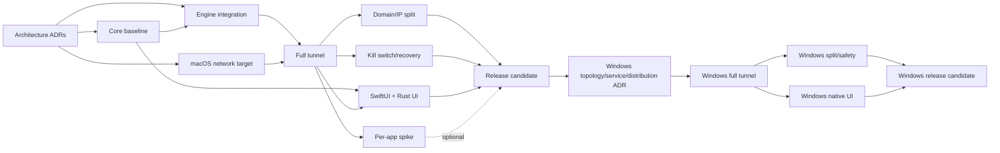

# NovaRay: план реализации roadmap

Этот файл отвечает на вопрос «в каком порядке выполнять задачи». Полный инвентарь работ находится в [roadmap](../learning/05_roadmap_zero_to_hero.md), требования — в [SPEC_RU](./SPEC_RU.md).

## 1. Принципы исполнения

1. Работать вертикальными срезами, которые заканчиваются наблюдаемым сетевым результатом.
2. Не начинать GUI раньше architecture spikes: UI не должен закрепить неверный lifecycle API.
3. Не считать no-op/mock тест production evidence.
4. Каждая операция изменения сети получает rollback до объединения в main.
5. Per-app routing не блокирует domain/IP MVP, но является одной из двух главных функций продукта и
   определяет выбор движка (ADR-004).
6. Каждый milestone завершается evidence bundle: команды, тестовые результаты, известные gaps и rollback.
7. Release order фиксирован: сначала M0—M8 и production macOS Apple Silicon, затем M9—M13 и
   production Windows 11 x64, затем Android.
8. Платное членство Apple Developer Program не приобретается: первый релиз распространяется исходным
   кодом, системный туннель строится на privileged helper + `utun` (ADR-002, ADR-003).

## 2. Definition of Ready для задачи

Задача готова к реализации, если:

- указан связанный `FR-*`/`NFR-*`;
- понятна доверительная и privilege boundary;
- определены success и failure scenarios;
- выбран способ проверки;
- нет незакрытого архитектурного gate;
- изменение спецификации сделано до кода.

## 3. Definition of Done

Задача завершена, когда:

- код и документация синхронизированы;
- unit/contract/integration tests соответствуют риску;
- ошибки и rollback проверены;
- `cargo fmt`, Clippy и применимые build/test gates зелёные;
- нет secrets в fixtures/logs;
- создано воспроизводимое evidence, а не только устное подтверждение.

## 4. Потоки работ

| Поток | Ответственность | Основные зависимости |
|---|---|---|
| A. Architecture | distribution, NetworkExtension/helper, engine, UI ADR | начинается первым |
| B. Rust Core | config, parser, policy, state machine, diagnostics | может идти параллельно со spikes |
| C. Engine | artifact, generator, supervisor, local proxy E2E | зависит от engine ADR |
| D. macOS Network | tunnel, routes, DNS, kill switch, recovery | зависит от distribution/network ADR |
| E. UI/FFI | SwiftUI shell, FFI, menu bar, screens | зависит от lifecycle contract |
| F. Verification | server lab, leak/fault/UI/release tests | сопровождает каждый milestone |
| G. Release | signing, notarization, updater, documentation | после stable vertical slice |
| H. Shared Platform Contracts | versioned commands/events, capabilities, compatibility | начинается в M1, обязателен для обоих adapters |
| I. Windows Architecture | topology, Service/IPC, UI, distribution/signing ADR | после macOS release, до Windows code |
| J. Windows Network | full/split tunnel, DNS, safety/recovery | после Windows decision package |
| K. Windows UI/Release | native shell, installer, update, clean-machine tests | после Windows full-tunnel slice |

## 5. Последовательность milestones

### M0 — Decision package

Цель: убрать архитектурную неопределённость и зафиксировать базовые архитектурные предложения (Gate A).

Статус: **частично завершён (`[~]`)** — спайки Gate A выполнены, пакет ADR оформлен в статусе
`Proposed`; runtime-активация расширения и окончательный выбор production-движка вынесены в
обязательный Gate B перед M3.

Задачи:

1. Провести SwiftUI + Rust FFI spike (issue #7, #9).
2. Создать минимальный NetworkExtension packet tunnel target (issue #7) — остаётся evidence для отложенного пути.
3. Проверить direct distribution и App Store constraints (issue #1).
4. Проверить engine subprocess и embedded options (issue #12).
5. Оформить архитектурные предложения ADR-001/002/003/004/006 (issue #14).
6. Обновить architecture diagram и Cargo/Xcode workspace plan.

Проверка Gate A (выполнено):

- arm64 demo app вызывает Rust и получает event обратно;
- проект Xcode собирает app + embedded system extension target;
- документированы entitlement/subprocess ограничения;
- зафиксированы базовые предложения по release channel и engine candidates.

Остающиеся гейты Gate B (перед M3):
- запуск development-signed network extension в системе;
- окончательный выбор и подтверждение production engine topology на Apple Silicon.

Stop condition: если NetworkExtension и выбранный engine несовместимы, не строить поверх них product code; вернуться к topology decision.

### M1 — Core quality baseline

Цель: сделать текущую библиотеку безопасной основой.

Порядок:

1. Устранить duplicate module compilation в binary.
2. Исправить Clippy warnings и ввести CI — Clippy исправлен; CI baseline из issue
   development task #3 подтверждён успешным
   recorded CI run 31949037576.
3. Создать JSON schemas.
4. Ввести typed protocol/security/mode/errors.
5. Добавить semantic validators.
6. Реализовать atomic config storage и migrations.
7. Добавить redaction primitives.
8. Добавить parser property/fuzz tests.

Acceptance:

```bash
cargo fmt --check
cargo clippy --all-targets -- -D warnings
cargo test --all-targets
```

Дополнительно schema fixtures проходят positive/negative corpus, а fuzz smoke run не падает.

### M2 — Real local VLESS vertical slice

Цель: реальное соединение через локальный SOCKS/HTTP без системного tunnel.

Порядок:

1. Pin/checksum engine artifact.
2. Исправить TLS/Reality generator semantics.
3. Добавить engine config validation.
4. Реализовать supervisor state machine.
5. Реализовать bounded stdout/stderr readers.
6. Добавить readiness и graceful stop.
7. Поднять контролируемый VLESS Reality server fixture.
8. Выполнить proxied TCP запрос; затем UDP capability test.
9. Добавить negative tests и process-residue check.

Acceptance: тест доказывает другой egress/контролируемую remote reachability через engine и отсутствие child процесса после teardown.

### M3 — System tunnel vertical slice

Цель: полный tunnel без split routing.

Порядок:

1. Определить typed FFI/IPC lifecycle protocol.
2. Создать `ConnectionState` и serialized command executor.
3. Связать engine readiness с privileged helper (`launchd` + `utun`).
4. Применить IPv4, IPv6, MTU и DNS.
5. Исключить VPN endpoint из tunnel route.
6. Создать `NetworkSnapshot` и recovery journal.
7. Реализовать disconnect compensation.
8. Добавить external IP, DNS и route probes.
9. Проверить sleep/wake и network change.

Acceptance: чистый test Mac проходит connect → real traffic → disconnect, после чего diff routes/DNS/firewall равен ожидаемому baseline.

### M4 — Domain/IP split tunnel

Цель: первый реальный split-tunneling MVP.

Порядок:

1. Ввести typed rules и precedence.
2. Реализовать GeoIP/GeoSite data lifecycle.
3. Написать policy compiler.
4. Добавить routing section в engine config.
5. Добавить included/excluded OS routes при необходимости.
6. Реализовать effective-policy diagnostics.
7. Протестировать direct/proxy egress для domain и CIDR.
8. Проверить CNAME, cached DNS, QUIC и local networks.

Acceptance: packet-level evidence показывает одновременный direct и proxy egress в соответствии с policy.

### M5 — Failure safety

Цель: обеспечить rollback и kill switch до публичного UI.

Порядок:

1. Реализовать kill-switch state machine.
2. Зафиксировать control-plane allowlist.
3. Интегрировать engine/network health events.
4. Реализовать crash recovery следующего запуска.
5. Добавить fault injection на каждый connect step.
6. Проверить DNS/IPv6 leaks.
7. Проверить uninstall/disable cleanup.

Acceptance: все сценарии recovery matrix заканчиваются либо безопасным блокированием, либо подтверждённым исходным network state; тихого direct fallback нет.

### M6 — Native macOS product UI

Цель: предоставить полный пользовательский MVP flow.

Порядок:

1. Зафиксировать FFI ABI и version handshake.
2. Создать SwiftUI app shell и menu bar.
3. Подключить observed connection events.
4. Добавить profile list/editor/import preview.
5. Добавить domain/IP policy editor и preview.
6. Добавить settings и Keychain.
7. Добавить diagnostics/recovery screen.
8. Добавить localization и accessibility.
9. Измерить launch/idle CPU/memory.

Acceptance: все функции MVP доступны без CLI; UI automation и accessibility checklist проходят; UI не показывает ложный `Connected`.

### M7 — Per-app decision branch

Этот milestone можно выполнять параллельно после M3, но он не блокирует M6/M8.

Порядок:

1. Проверить MDM/per-app VPN constraints.
2. Прототипировать TCP/UDP process attribution.
3. Собрать failure/race measurements.
4. Принять ADR-005.
5. При положительном решении реализовать AppIdentity, flow attribution, policy enforcement и packet tests.
6. При отрицательном решении убрать feature из MVP UI и явно документировать ограничение.

Acceptance: либо есть доказанный per-app egress test, либо формально принято решение post-MVP без ложного обещания.

### M8 — Release candidate

Цель: получить устанавливаемый, проверяемый build.

Порядок:

1. Threat-model review и закрытие high findings.
2. SBOM, license и vulnerability audit.
3. Cargo + Xcode release orchestration.
4. Hardened Runtime и минимальные entitlements.
5. Sign nested components, `.app` и installer image.
6. Notarize и staple.
7. Clean-machine install/upgrade/uninstall tests.
8. Leak/fault/performance regression suite.
9. User/recovery/privacy documentation.
10. Staged rollout с rollback artifact.

Acceptance: все восемь критериев MVP из `SPEC_RU.md` подтверждены evidence bundle.

### M9 — Windows decision package

Цель: после первого macOS production release убрать Windows-архитектурную неопределённость до
product code.

Порядок:

1. Зафиксировать поддерживаемый Windows 11 baseline и `x86_64-pc-windows-msvc`.
2. Сравнить WFP, Wintun/TUN и engine-specific topology на реальном трафике.
3. Определить ownership routes, DNS, firewall/WFP filters, kill switch и recovery journal.
4. Создать Windows Service PoC под SCM с минимальными правами.
5. Спроектировать authenticated/versioned IPC, caller authentication и command allowlist.
6. Выполнить WinUI 3 + Rust core roundtrip spike и измерить launch/idle resources/accessibility.
7. Сравнить MSIX/Store и signed MSI/EXE distribution, update и rollback.
8. Принять Windows topology/distribution ADR; обновить threat model и test matrix.

Acceptance: выбран один topology и один distribution path; controlled Windows 11 x64 runner выполняет
service lifecycle и безопасную тестовую mutation/rollback; неизвестный IPC command отвергается.

Stop condition: не создавать production service/network code без принятого ADR и воспроизводимого
snapshot/rollback PoC.

### M10 — Windows full-tunnel vertical slice

Цель: реальный Windows 11 full tunnel без split routing.

Порядок:

1. Создать Windows platform crate и service skeleton без policy duplication.
2. Реализовать version/capability handshake и observed state events.
3. Интегрировать pinned engine и readiness supervision.
4. Сохранить Windows snapshot: adapters, routes, IPv4/IPv6, DNS, firewall/WFP state и services.
5. Исключить VPN endpoint/control channel из tunnel.
6. Применить tunnel, MTU, routes и DNS транзакционно.
7. Реализовать journaled disconnect и recovery следующего запуска.
8. Проверить TCP, UDP, DNS, IPv4/IPv6, network change, sleep/reboot и repeated connect/disconnect.

Acceptance: controlled Windows 11 host выполняет connect → observed real traffic → disconnect с
ожидаемым semantic snapshot diff и без process/service residue.

### M11 — Windows split tunneling и failure safety

Цель: применить общую policy semantics к Windows traffic и сделать failures безопасными.

Порядок:

1. Подключить общие typed domain/IP/CIDR rules и golden policy fixtures.
2. Скомпилировать effective policy в выбранные engine/OS primitives.
3. Реализовать DNS policy, endpoint-loop protection и local-network exceptions.
4. Реализовать kill-switch state machine и control-plane allowlist.
5. Выполнить отдельный Windows per-app spike; не переносить macOS assumptions.
6. Добавить fault injection для service, engine, UI, IPC, connect steps, reboot и upgrade.
7. Проверить direct/proxy egress, DNS/IPv6 leak и отсутствие WFP/firewall/route residue.

Acceptance: packet-level evidence подтверждает domain/IP split paths; failure matrix заканчивается
safe block или восстановленным baseline. Per-app либо доказан отдельно, либо исключён из release UI.

### M12 — Native Windows product UI

Цель: предоставить полный Windows user flow без административного терминала.

Порядок:

1. По принятому ADR создать native shell (рекомендуется WinUI 3).
2. Реализовать tray, single-instance lifecycle и launch-at-login поддерживаемым API.
3. Подключить versioned IPC и observed service/tunnel state.
4. Реализовать profiles/import, domain/IP policy editor и capability-aware UI.
5. Добавить credential storage, settings, diagnostics и network recovery action.
6. Добавить RU/EN localization, keyboard, screen-reader, high-contrast и DPI tests.
7. Измерить cold launch, idle memory/CPU и wakeups.

Acceptance: весь Windows flow доступен без CLI; UI не требует постоянного elevation и не показывает
ложный `Connected`; accessibility/resource budgets подтверждены.

### M13 — Windows release candidate

Цель: получить подписанный, обновляемый и удаляемый Windows 11 build.

Порядок:

1. Закрыть Windows threat-model high findings и supply-chain audit.
2. Собрать reproducible/versioned app, service, engine и rules artifacts.
3. Подписать binaries, service и installer выбранным production certificate path.
4. Проверить install, service registration, upgrade, rollback и clean uninstall.
5. Выполнить L0—L8 и Windows failure/leak/performance regression suite.
6. Подготовить user/recovery/privacy documentation и staged rollout stop conditions.

Acceptance: все восемь Windows criteria из `SPEC_RU.md` подтверждены на clean Windows 11 x64
machine; package identity, signatures и rollback traceable до source revisions.

## 6. Первые 12 исполнимых задач

Это рекомендуемая ближайшая очередь для первого macOS release. Windows product work не подменяет её:

1. Создать issue/ADR для distribution channel — issue
   development task #1, [ADR-002](./ADR-002-MACOS-DISTRIBUTION.md)
   зафиксирован со статусом `Proposed`.
2. Зафиксировать platform scope и boundaries — issue
   development task #5, [ADR-006](./ADR-006-CROSS-PLATFORM-BOUNDARIES.md)
   зафиксирован со статусом `Proposed`.
3. Создать Xcode SwiftUI + NetworkExtension spike вне production path — issue
   development task #7, спайк реализован в
   `spikes/macos-networkextension-spike/`.
4. Создать минимальный Rust C ABI crate и roundtrip Swift test — issue
   development task #9, изолированный arm64 spike реализован в
   `spikes/macos-rust-ffi-spike/`.
5. Проверить Xray/Sing-box embedding/subprocess constraints в spike — issue
   development task #12: pinned upstream/license/artifact и
   topology evidence сохранены в `spikes/macos-engine-topology-spike/`.
6. Оформить пакет решений ADR-001—004 — issue development task #14:
   [ADR-001](./ADR-001-MACOS-UI.md), [ADR-002](./ADR-002-MACOS-DISTRIBUTION.md),
   [ADR-003](./ADR-003-NETWORK-TOPOLOGY.md), [ADR-004](./ADR-004-ENGINE-INTEGRATION.md) и
   [ADR-006](./ADR-006-CROSS-PLATFORM-BOUNDARIES.md) оформлены со статусом `Proposed`. M0 (Decision
   Package) зафиксирован на уровне архитектурного бейзлайна Gate A (runtime-активация требует Gate B).
7. Добавить JSON schemas и typed enums — issue development task #16:
   добавлены `schema/config.schema.json`, `schema/settings.schema.json`, типизированные перечисления
   (`ProtocolType`, `SecurityType`, `FlowType`, `SplitTunnelMode`), строгая валидация правил доменов и IP в
   `SplitTunnelingSettings::validate()`, fail-closed URI-парсер, компиляция и проверка схем через `jsonschema`
8. Исправить standard TLS generation и Reality validation — issue development task #18:
   добавлен `allowInsecure: false` для стандартного TLS и актуальное поле `password` для Reality в `src/xray_generator.rs`;
   реализованы дефолты и fallback для опциональных параметров Reality (`shortId: ""`, `fingerprint: "chrome"`);
   внедрена строгая валидация SNI (RFC 6066 hostname без IP-литералов, поддержка IPv6 в парсере без SNI), Reality `public_key` (32-байтный Base64 X25519), четный hex `short_id` (до 16 символов) и uTLS `fingerprint`.
9. Реализовать supervisor log drain/readiness/graceful stop — issue
   development task #21: реализована State Machine жизненного цикла
   `Stopped/Starting/Ready/Stopping/Failed`, асинхронный log drain (stdout/stderr) с кольцевым буфером,
   readiness probe (TCP-порт / log pattern / immediate) с таймаутом, graceful stop (SIGTERM) с fallback
   на SIGKILL, автоочистка runtime-конфигураций и мониторинг аварийного завершения дочернего процесса.
10. Поднять контролируемый VLESS Reality integration environment — issue development task #23:
    реализован модуль `src/engine.rs` с верификацией бинарных артефактов движка (`verify_engine_artifact`, SHA-256 validation),
    безопасной записью runtime-конфигурации с правами `0600` (`write_secure_runtime_config`, `cleanup_runtime_config`),
    высокоуровневым оркестратором `ProxyService` (`AppConfig` -> `XrayConfigGenerator` -> `ProcessSupervisor`),
    а также набором интеграционных тестов `tests/integration_pipeline_tests.rs` (mock proxy server, TCP proxy request/response).
11. Получить реальный local-proxy E2E — issue development task #25:
    реализована pre-flight валидация сгенерированной конфигурации движком (`preflight_check_config`, `xray run -test -c`),
    зафиксированы эталонные версии и чексуммы Xray-core (`PinnedEngineRelease`, `get_pinned_engine_releases`, `find_pinned_checksum`),
    добавлены опции запуска `ProxyServiceOptions` и метод `start_with_options` с предварительной проверкой свободных портов (`PortInUse`),
    реализован сквозной E2E integration test с полноценным протокольным SOCKS5 (RFC 1928 handshake + CONNECT + bidirectional relay)
12. Ревизия архитектуры 2026-08-17 — issue development task #27, PR
    change review #28: пересмотрены ADR-001—004 и ADR-006 (движок sing-box
    вместо Xray-core для per-app split tunneling по ADR-004, privileged helper + `utun` по ADR-003,
    source-first distribution по ADR-002, scope macOS/Windows/Android по ADR-006, UI macOS —
    SwiftUI без второго стека по ADR-001), синхронизированы `SPEC_RU.md`, `SPEC_EN.md`, `ARCHITECTURE.md` и roadmap.
13. [~] Реализовать CLI foreground-интерфейс `start`/`connect`/`status`/`validate` поверх `ProxyService` — issue
    development task #29, PR change review #31:
    реализован модуль `src/cli.rs` и точка входа `src/main.rs`, поддерживающие foreground-команды `start`/`connect`,
    `validate`/`check`, `status`, `pinned-releases`, `--help`, `--version`, стандартизированные коды возврата (`ExitCode`:
    0 — Success, 1 — General/IO, 2 — Usage, 3 — Validation, 4 — Engine), обработку сигналов `SIGINT`/`SIGTERM` с отменой
    до готовности и гарантированной очисткой runtime-конфигурации (`0600`), а также интеграционные тесты (`tests/cli_tests.rs`).
    Команда удалённого `disconnect`/`stop` для фонового демона отложена до появления persistent control boundary в Milestone 3 (ADR-003).
14. [x] Реализовать генератор конфигурации sing-box как сменяемую стратегию и зафиксировать его артефакт
    (version, revision, checksum архива и бинарника) — issue development task #1:
    добавлен `EngineConfigStrategy` с сохранением Xray path по умолчанию, `SingBoxConfigGenerator`,
    strategy-aware pre-flight (`sing-box check -c`) и pinned metadata для sing-box `v1.13.18`
    (`darwin-arm64`, `linux-arm64`, `windows-amd64`: revision, archive SHA-256 и binary SHA-256).
    Generated Reality/TCP config прошёл real `sing-box check -c`; TUN/DNS/routing/system tunnel не входят
    в эту задачу.
15. [x] Добавить fail-closed на неподдерживаемый транспорт VLESS URI, затем поддержать WebSocket/gRPC — issue
    development task #33: шаг 1 реализует типизированный `TransportType::Tcp`,
    принимает отсутствие `type`, `type=tcp`, совместимый alias `type=raw`, отсутствие `headerType` и
    `headerType=none`; non-TCP transport, иной `headerType` и некорректный регистр известных критичных
    query keys отклоняет до создания профиля. В шаге 2 реализованы engine-neutral поля `transport`,
    `host`, `path`, schema/semantic validation и генерация Xray `wsSettings`/`grpcSettings`; оба
    конфига проходят `xray run -test` на pinned `v26.3.27`; controlled loopback test поднимает
    реальные Xray server/client и проводит HTTP-запрос через SOCKS5 поверх обоих транспортов.
    Correction-pass PR #35 добавляет fail-closed матрицу Reality (WebSocket запрещён, gRPC разрешён),
    нормализацию пустых query-значений, server fallback для transport host, Schema↔Rust parity для TCP
    и ограничение текущей gRPC capability стандартным `serviceName` без `/`.
16. [x] Открыть выбор формата конфигурации движка в CLI — issue #4: добавить
    `--engine-config xray|sing-box` с Xray по умолчанию; путь `--engine-bin` не меняет стратегию;
    неизвестное значение возвращает usage error до I/O. Покрыть default, sing-box, invalid value и
    mapping в `ProxyServiceOptions`; после этого обновить help и примеры.
17. [x] Уточнить диагностику verification engine artifact — issue #5: одна pinned версия на
    strategy, без user-selectable version и без доверия к выводу binary version; отдельные ошибки
    для pinned mismatch (engine/version/OS/arch) и отсутствующего platform pin, при сохранении
    explicit SHA-256 override и fail-closed поведения. Покрыть explicit override, mismatch и
    missing pin unit/integration tests.
18. [x] Завершить pinned binary checksum matrix — issue #3: Xray-core и sing-box для macOS arm64/x86_64,
    Linux arm64/x86_64 и Windows x86_64; добавить archive/binary evidence, explicit unsupported-target
    contract в `pinned-releases`/документации и test, запрещающий binary checksum gaps для declared matrix.
19. [x] Versioned engine catalog и offline updater — issue #9: отделить конфигурационный диалект от
    artifact release, ввести lifecycle `recommended`/`supported`/`deprecated`/`yanked`, JSON catalog,
    offline инварианты и maintainer-only candidate generator. CLI version selection отложен до
    compatibility contract и real-engine evidence.
20. Только после этого начать macOS system tunnel vertical slice на privileged helper.
21. [x] Contract совместимости engine release/configuration dialect — issue #11: typed dialect,
    exact catalog-level dialect per engine/version, fail-closed incompatibility before checksum source
    selection/process start и real macOS arm64 preflight для текущих пар.
22. [x] CLI selector engine version — issue #13: добавить `--engine-version <VERSION>` поверх
    versioned catalog и ADR-007; selected version должна резолвиться до binary/checksum/preflight,
    `recommended`/`supported` разрешаются, `deprecated` печатает warning, `yanked`/unknown/
    incompatible версии fail-closed, а `--expected-sha256` остаётся override байтов, не версии.
23. [x] Platform helper IPC contract skeleton — issue #15: добавить platform-neutral typed contract
    для будущего privileged helper/service boundary (`HelperHello`, `CoreHello`, capabilities,
    allowlisted commands/events, bounded validation). Scope intentionally excludes launchd/root,
    IPC transport, install/uninstall, `utun`, routes, DNS, firewall, system proxy and remote
    daemon `disconnect` wiring.

## 7. Зависимости



## 8. Рекомендуемый ритм

Для каждого milestone:

1. Одностраничный design note и threat-boundary review.
2. Минимальная end-to-end проверка до расширения API.
3. Негативные сценарии и rollback в той же итерации.
4. Документация и evidence до отметки `[x]`.
5. Demo на чистой целевой машине: Apple Silicon Mac для M0—M8, Windows 11 x64 для M9—M13.

Не использовать календарные оценки вроде «5 дней на TUN» до завершения architecture spikes: для NetworkExtension, entitlements и engine embedding такая оценка создаёт ложную точность.

## 9. Управление рисками

| Риск | Ранний сигнал | Реакция |
|---|---|---|
| Engine нельзя использовать в extension | subprocess/embedding spike не проходит | выбрать helper topology или другой engine до product code |
| Per-app доступен только в ограниченном сценарии | MDM/attribution gate отрицательный | выпустить domain/IP MVP, не имитировать функцию |
| Route/DNS residue после crash | fault test показывает diff | остановить UI/release work и исправить transaction model |
| FFI нестабилен | ownership/thread crash | сузить ABI, передавать serialized immutable messages |
| UI расходует ресурсы в idle | CPU wakeups/repaint | устранить polling; не переходить к Metal |
| Документация снова опережает код | компонент есть только на diagram | требовать evidence link перед `[x]` |
| Hosted Windows CI принят за Win11 system test | green `windows-latest` job | маркировать как portability-only; system gates запускать на controlled Win11 |
| Platform adapters расходятся по policy | разные outcomes общих fixtures | один Rust policy compiler и versioned golden contract tests |

## 10. Отчётность о прогрессе

Для каждого завершённого пункта roadmap сохранять:

- commit/revision;
- связанное требование;
- тест/команду;
- краткий результат;
- известные gaps;
- rollback;
- платформу, OS version и architecture.

Зелёный unit test без реального network evidence не закрывает задачи tunnel, split routing, DNS или recovery.
