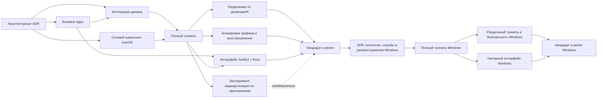

# NovaRay: план реализации дорожной карты

Этот файл отвечает на вопрос «в каком порядке выполнять задачи». Полный перечень работ находится
в [дорожной карте](../learning/05_roadmap_zero_to_hero.md), требования — в [SPEC_RU](./SPEC_RU.md).

## 1. Принципы исполнения

1. Вести сетевые этапы к наблюдаемому сетевому результату. Подготовительная задача может завершаться
   документацией или проверкой контракта, но не закрывает этим весь этап.
2. Не начинать графический интерфейс раньше архитектурных экспериментов: интерфейс не должен
   закрепить неверный API жизненного цикла.
3. Не считать тесты без реальных действий или с имитацией подтверждением готовности продукта.
4. Каждая операция изменения сети получает откат до включения в `main`.
5. Маршрутизация по приложениям не блокирует MVP с разделением по доменам/IP, но является одной
   из двух главных функций продукта и определяет выбор движка (ADR-004).
6. Каждый этап завершается набором подтверждений: команды, результаты тестов, известные пробелы
   и процедура отката.
7. Порядок релизов фиксирован: сначала M0—M8 и готовая версия для macOS Apple Silicon,
   затем M9—M13 и готовая версия для Windows 11 x64, затем Android.
8. Платное членство Apple Developer Program не приобретается: первый релиз распространяется
   исходным кодом, системный туннель строится на привилегированном вспомогательном процессе
   и `utun` (ADR-002, ADR-003).

## 2. Критерии готовности задачи к выполнению

Задача готова к реализации, если:

- указан связанный `FR-*`/`NFR-*`;
- понятны границы доверия и привилегий;
- определены успешные и ошибочные сценарии;
- выбран способ проверки;
- нет незакрытого архитектурного контрольного этапа;
- изменение спецификации сделано до кода.

## 3. Критерии завершения задачи

Задача завершена, когда:

- код и документация синхронизированы;
- модульные, контрактные и интеграционные тесты соответствуют риску;
- ошибки и откат проверены;
- `cargo fmt`, Clippy и применимые проверки сборки и тестирования проходят;
- в тестовых данных и журналах нет секретов;
- создано воспроизводимое подтверждение, а не только устное заявление.

## 4. Потоки работ

| Поток | Ответственность | Основные зависимости |
|---|---|---|
| A. Архитектура | распространение, NetworkExtension или вспомогательный процесс, ADR движка и интерфейса | начинается первым |
| B. Rust-ядро | конфигурация, парсер, политика, машина состояний, диагностика | может идти параллельно с экспериментами |
| C. Движок | артефакт, генератор, супервизор, сквозная проверка локального прокси | зависит от ADR движка |
| D. Сеть macOS | туннель, маршруты, DNS, аварийная блокировка трафика, восстановление | зависит от ADR распространения и сети |
| E. Интерфейс и FFI | оболочка SwiftUI, FFI, строка меню, экраны | зависит от контракта жизненного цикла |
| F. Проверки | серверная лаборатория, тесты утечек, сбоев, интерфейса и релиза | сопровождает каждый этап |
| G. Выпуск | релиз из исходников по Gate S, воспроизводимость, откат, документация; подпись и нотаризация отложены | после устойчивой сквозной реализации |
| H. Общие платформенные контракты | версионируемые команды и события, возможности, совместимость | начинается в M1, обязателен для обоих адаптеров |
| I. Архитектура Windows | топология, служба и IPC, интерфейс, ADR распространения и подписи | после релиза macOS, до кода Windows |
| J. Сеть Windows | полное и раздельное туннелирование, DNS, безопасность и восстановление | после пакета решений Windows |
| K. Интерфейс и выпуск Windows | нативная оболочка, установщик, обновление, проверки на чистой машине | после сквозной реализации полного туннеля Windows |

## 5. Последовательность этапов

### Текущее состояние и ближайшая очередь

Сверка 2026-09-13: база `main` на `d6edf24` (после слияния PR #93). Ни число завершённых задач, ни существование
адаптера не доказывают прохождение этапа. Статусы ниже относятся к полным критериям его приёмки;
подробные связи требований и проверок находятся в [TRACEABILITY](./TRACEABILITY.md).

| Этап | Состояние | Что есть в дереве | Что не доказано |
|---|---|---|---|
| M0 | частично | эксперименты Gate A, пакет ADR, предложения по релизу из исходников и вспомогательному процессу | принятие ADR со статусом `Proposed`, Gate I/H/S и рабочая топология движка |
| M1 | частично | типизированные модели и валидаторы, набор проверок JSON Schema, сокрытие чувствительных данных, Rust CI | атомарное хранилище профилей, миграции, проверки свойств и фаззинг |
| M2 | частично | команды переднего плана, ProxyService, каталог и выбор версии, предварительная проверка, супервизор; явно запускаемые реальные локальные тесты Xray WS/gRPC | контролируемый удалённый VLESS Reality, UDP и полный набор подтверждений M2 |
| M3 | частично, только подготовка | контракты состояния сети, восстановления, установки, допуска и жизненного цикла прав; нативные адаптеры учётных данных и чтения права | привилегированная установка и удаление, постоянный аутентифицированный IPC, запись Authorization Services, `utun` и прохождение пакетов |
| M4–M5 | нет системных подтверждений | сопоставление правил и тесты транзакций/восстановления с регистрирующими адаптерами | применение политики к реальному трафику, утечки DNS, аварийная блокировка и откат после сбоя или перезагрузки |
| M6–M8 | только подготовка | эксперименты интерфейса и FFI, требования маршрутизации по приложениям, определение релиза из исходников | рабочий интерфейс продукта, эксперимент или решение об отсрочке M7, подтверждение релиза по Gate S |
| M9–M14 | отложено | межплатформенные контракты и целевой план | продуктовые и системные проверки Windows, расширения после релиза |

Это сверка исходников и существующего набора тестов, не новый запуск программы. Точки проверки:
[`src/engine.rs`](../src/engine.rs), [`src/core.rs`](../src/core.rs), [`src/cli.rs`](../src/cli.rs),
[`tests/`](../tests/), [TESTING](./TESTING.md). «Частично» не означает работающую VPN-функцию.

Ближайшая очередь отделена от исторического журнала раздела 6; номера задач не перенумеровываются.
Новые execution task записываются по [RULE-001](./rules/RULE-001-EXECUTION-TASK-METADATA.md):
у каждой задачи должны быть стабильные `Task ID`, title, description, issue и PR.

| Task ID | Статус | Title | Description | Issue | PR |
|---|---|---|---|---|---|
| 61 | `[x]` | Протокол проверки системного права авторизации | Документирует изолированный native experiment, disposable environment, restore и per-run approval; не разрешает запуск эксперимента. | [#92](https://github.com/MaratGaZa/novaray-public/issues/92) | [#93](https://github.com/MaratGaZa/novaray-public/pull/93) |
| 62 | `[x]` | Сверка документации и перевод плана реализации | Согласует состояние документов после PR #93 и переводит план реализации на русский без изменения code/system evidence. | [#94](https://github.com/MaratGaZa/novaray-public/issues/94) | [#95](https://github.com/MaratGaZa/novaray-public/pull/95) |
| 63 | `[x]` | Изолированный исполнитель базовой проверки системного права | Реализует opt-in base-case harness под `native-right-experiment`; ordinary tests/CI не запускают запись в системную базу. | [#96](https://github.com/MaratGaZa/novaray-public/issues/96) | [#97](https://github.com/MaratGaZa/novaray-public/pull/97) |
| 64 | `[x]` | Сверка ближайшей очереди после базового native harness | Фиксирует, что task 63 уже в `main`, а live Authorization Services mutation остаётся заблокированной без disposable environment и отдельного approval. | [#98](https://github.com/MaratGaZa/novaray-public/issues/98) | [#99](https://github.com/MaratGaZa/novaray-public/pull/99) |
| 65 | `[x]` | Валидатор metadata execution task | Автоматически проверяет, что реестр RULE-001 соответствует нумерованному журналу задач и что issue/PR metadata заполнены. | [#100](https://github.com/MaratGaZa/novaray-public/issues/100) | [#101](https://github.com/MaratGaZa/novaray-public/pull/101) |
| 66 | `[x]` | Preflight native-right эксперимента без мутаций | Добавляет safe `--preflight` для `native-right-roundtrip`, который проверяет только автоматизируемые условия и не разрешает live `--run`. | [#102](https://github.com/MaratGaZa/novaray-public/issues/102) | [#103](https://github.com/MaratGaZa/novaray-public/pull/103) |
| 67 | `[x]` | Readiness evidence template для native-right эксперимента | Добавляет публичный non-authorizing template и offline validator формы будущего private evidence без запуска `--run` или системных мутаций. | [#104](https://github.com/MaratGaZa/novaray-public/issues/104) | [#105](https://github.com/MaratGaZa/novaray-public/pull/105) |
| 68 | `[x]` | Порядок защиты перед маршрутами и DNS | Закрепляет firewall перед AddRoute/SetDns при включённом kill switch, отказ до исполнения и сохранение порядка старых recovery-журналов. | [#106](https://github.com/MaratGaZa/novaray-public/issues/106) | [#107](https://github.com/MaratGaZa/novaray-public/pull/107) |
| 69 | `[x]` | Типизированная allowlist endpoint и туннеля | Задаёт immutable egress-контракт точного endpoint и отдельного tunnel interface с default deny; не применяет системные правила. | [#108](https://github.com/MaratGaZa/novaray-public/issues/108) | [#109](https://github.com/MaratGaZa/novaray-public/pull/109) |

После слияния PR #107 выполнена задача 69 / issue #108 / PR #109:
**Типизированная allowlist endpoint и туннеля**. Статус: `[x]` по unit acceptance;
PR ожидает review, слияние не утверждается. Полный локальный Rust suite: 345 passed,
0 failed, 5 ignored; fmt и strict Clippy прошли. Это подготовка фазы 6.1, не системная защита.
Контракт не подключён автоматически к `plan()`/`execute()` и не разрешает native-run.
Полная allowlist, включая DHCP/NDP/bootstrap/inbound и применение в ОС, остаётся открытой;
следующая execution task требует отдельной команды владельца.

Протокол [изолированной проверки системного права](./AUTHORIZATION_RIGHT_NATIVE_VALIDATION.md)
уже включён в проект, но его слияние не разрешает эксперимент. Для реального запуска нужны
выделенная одноразовая среда macOS с проверенным восстановлением и отдельное одобрение конкретного
эксперимента. Текущая рабочая машина не считается такой средой по умолчанию; при отсутствии среды
или одобрения изменение системы заблокировано. Чтение системных данных и регистрирующие адаптеры
этого условия не заменяют.

Следующий технический шаг по Authorization Services не может быть live-run по умолчанию. Он должен
быть оформлен отдельной задачей после выбора владельцем конкретной одноразовой среды и способа
проверяемого восстановления либо как отдельная подготовительная проверка среды без мутации базы.

### M0 — Пакет архитектурных решений

Цель: убрать архитектурную неопределённость и зафиксировать базовые архитектурные предложения (Gate A).

Статус: **частично завершён (`[~]`)** — эксперименты Gate A выполнены, пакет ADR оформлен
в статусе `Proposed`. Перед реальной сетевой реализацией M3 остаются проверки установки
и работы вспомогательного процесса, а также подтверждение рабочего движка.
NetworkExtension Gate B относится только к отложенному пути ADR-002/003.

Задачи:

1. Провести эксперимент SwiftUI + Rust FFI (задачи #7, #9).
2. Создать минимальную цель сборки пакетного туннеля NetworkExtension (задача #7);
   результат остаётся подтверждением для отложенного пути.
3. Проверить ограничения прямого распространения и App Store (задача #1).
4. Проверить запуск движка отдельным процессом и варианты встраивания (задача #12).
5. Оформить архитектурные предложения ADR-001/002/003/004/006 (задача #14).
6. Обновить архитектурную схему и план рабочей области Cargo/Xcode.

Проверка Gate A (выполнено):

- демонстрационное приложение arm64 вызывает Rust и получает событие обратно;
- проект Xcode собирает приложение и встроенную цель системного расширения;
- документированы ограничения специальных разрешений Apple и дочерних процессов;
- зафиксированы базовые предложения по каналу распространения и кандидатам движка.

Остающиеся условия для вспомогательного процесса при распространении из исходников:
- Gate I ADR-003: доказанная привилегированная установка и удаление либо эквивалентные
  документированные подтверждения;
- проверка ADR-009 перед реальными командами и Gate H ADR-003 для приёмки вспомогательного
  процесса и передачи данных;
- подтверждение рабочей топологии движка на Apple Silicon по ADR-004;
- явное утверждение применимых ADR со статусом `Proposed` владельцем после требуемых проверок.

Gate B (активация NetworkExtension с подписью для разработки) отложен до платного аккаунта
и не блокирует этот путь. Подготовительные контракты и адаптеры только для чтения не закрывают Gate I/H.

Условие остановки: если выбранная связка вспомогательного процесса и движка не проходит проверки
привилегий, аутентификации, прохождения пакетов или отката, не строить поверх неё рабочий продукт;
вернуться к решению о топологии.

### M1 — Базовое качество ядра

Цель: сделать текущую библиотеку безопасной основой.

Порядок:

1. Устранить повторную компиляцию модулей в исполняемом файле.
2. Исправить предупреждения Clippy и ввести CI: Clippy исправлен; базовый CI из задачи #3
   подтверждён успешным сохранённым прогоном 31949037576.
3. Создать JSON-схемы.
4. Ввести типизированные протоколы, режимы безопасности, режимы работы и ошибки.
5. Добавить семантические валидаторы.
6. Реализовать атомарное хранилище конфигурации и миграции.
7. Добавить средства сокрытия чувствительных данных.
8. Добавить проверки свойств и фаззинг парсера.

Критерии приёмки:

```bash
cargo fmt --check
cargo clippy --all-targets -- -D warnings
cargo test --all-targets
```

Дополнительно тестовые данные схем проходят позитивные и негативные проверки,
а базовый прогон фаззинга не приводит к сбою.

### M2 — Сквозная реализация локального VLESS

Цель: реальное соединение через локальный SOCKS/HTTP без системного туннеля.

Порядок:

1. Зафиксировать артефакт движка и его контрольную сумму.
2. Исправить семантику генерации TLS/Reality.
3. Добавить валидацию конфигурации движком.
4. Реализовать машину состояний супервизора.
5. Реализовать чтение stdout/stderr с ограниченным буфером.
6. Добавить проверку готовности и штатную остановку.
7. Поднять контролируемый тестовый сервер VLESS Reality.
8. Выполнить TCP-запрос через прокси, затем проверить поддержку UDP.
9. Добавить негативные тесты и проверку отсутствия оставшихся процессов.

Критерии приёмки: тест доказывает выход через другой адрес или достижимость контролируемого
удалённого узла через движок и отсутствие дочернего процесса после завершения проверки.

### M3 — Сквозная реализация системного туннеля

Цель: полный туннель без раздельной маршрутизации.

Порядок:

1. Определить типизированный протокол жизненного цикла для FFI/IPC.
2. Создать `ConnectionState` и последовательный исполнитель команд.
3. Связать готовность движка с привилегированным вспомогательным процессом (`launchd` + `utun`).
4. Применить IPv4, IPv6, MTU и DNS.
5. Исключить адрес сервера VPN из маршрута туннеля.
6. Создать `NetworkSnapshot` и журнал восстановления.
7. Реализовать компенсирующие действия при отключении.
8. Добавить проверки внешнего IP, DNS и маршрутов.
9. Проверить сон, пробуждение и смену сети.

Критерии приёмки: чистый тестовый Mac проходит подключение, передачу реального трафика и отключение;
после этого различия маршрутов, DNS и межсетевого экрана соответствуют ожидаемому исходному состоянию.

### M4 — Раздельное туннелирование по доменам и IP

Цель: первый реальный MVP раздельного туннелирования.

Порядок:

1. Ввести типизированные правила и их приоритеты.
2. Реализовать жизненный цикл данных GeoIP/GeoSite.
3. Написать компилятор политики.
4. Добавить раздел маршрутизации в конфигурацию движка.
5. При необходимости добавить включаемые и исключаемые маршруты ОС.
6. Реализовать диагностику фактически действующей политики.
7. Проверить прямой выход и выход через прокси для доменов и CIDR.
8. Проверить CNAME, кешированный DNS, QUIC и локальные сети.

Критерии приёмки: пакетные проверки показывают одновременный прямой выход и выход через прокси
в соответствии с политикой.

### M5 — Безопасность при сбоях

Цель: обеспечить откат и аварийную блокировку трафика до публичного интерфейса.

Порядок:

1. Реализовать машину состояний аварийной блокировки трафика.
2. Зафиксировать список разрешённых соединений управления.
3. Интегрировать события состояния движка и сети.
4. Реализовать восстановление после сбоя при следующем запуске.
5. Добавить внедрение сбоев на каждом шаге подключения.
6. Проверить утечки DNS/IPv6.
7. Проверить очистку при удалении и отключении.

Критерии приёмки: все сценарии матрицы восстановления заканчиваются либо безопасной блокировкой,
либо подтверждённым исходным состоянием сети; скрытого перехода к прямому соединению нет.

### M6 — Нативный интерфейс продукта для macOS

Цель: предоставить полный пользовательский сценарий MVP.

Порядок:

1. Зафиксировать ABI для FFI и согласование версий.
2. До рабочего редактора профилей зафиксировать контракт расширяемости протоколов:
   `ProtocolType` остаётся типизированным признаком протокола; его поля описываются метаданными
   и схемой; интерфейс, вспомогательный процесс и IPC не предполагают, что профиль всегда VLESS.
3. Создать оболочку приложения SwiftUI и строку меню.
4. Подключить события наблюдаемого состояния соединения.
5. Добавить список и редактор профилей, предварительный просмотр импорта поверх метаданных
   протокола. Первый интерфейс показывает VLESS, но форма не должна требовать переписывания
   для Trojan/Shadowsocks/Hysteria2/TUIC/WireGuard/VMess.
6. Добавить редактор и предварительный просмотр политики доменов/IP.
7. Добавить настройки и Keychain.
8. Добавить экран диагностики и восстановления.
9. Добавить локализацию и доступность.
10. Измерить запуск, загрузку CPU и память в простое.

Критерии приёмки: все функции MVP доступны без командной строки; автоматизированные проверки
интерфейса и доступности проходят; интерфейс не показывает ложный `Connected`.

### M7 — Решение о маршрутизации по приложениям

Этот этап можно выполнять параллельно после M3, но он не блокирует M6/M8.

Порядок:

1. Проверить ограничения MDM и VPN по приложениям.
2. Создать прототип определения процесса для TCP/UDP.
3. Измерить сбои и гонки.
4. Принять отдельный ADR или решение о границах маршрутизации по приложениям.
5. При положительном решении реализовать AppIdentity, определение принадлежности потоков,
   применение политики и пакетные тесты.
6. При отрицательном решении убрать функцию из интерфейса MVP и явно документировать ограничение.

Критерии приёмки: либо тест доказал отдельный выход трафика приложения,
либо формально принято решение об отсрочке после MVP без ложного обещания.

### M8 — Кандидат в релиз

Цель: получить устанавливаемую и проверяемую сборку.

Порядок:

1. Пересмотреть модель угроз и закрыть замечания высокой серьёзности.
2. Подготовить SBOM, провести аудит лицензий и уязвимостей.
3. Организовать сборку из исходников через Cargo и Xcode.
4. Подтвердить релиз из исходников по ADR-002 Gate S: воспроизводимая сборка из чистого клона
   на Apple Silicon с документированными зависимостями, отдельно — запуск, установка и удаление
   на чистом Mac.
5. Подготовить SBOM, зафиксированные версии и контрольные суммы движков, проверить лицензию
   и ограничения именования sing-box.
6. Выполнить регрессионные тесты утечек, сбоев и производительности.
7. Подготовить документацию пользователя, восстановления и приватности,
   включая установку без обхода Gatekeeper.
8. Подготовить материал для отката релиза из исходников: предыдущий тег или ревизия исходников,
   процедура пересборки и повторной установки.
9. Выполнять подпись Developer ID, применять Hardened Runtime, нотаризацию и прикрепление билета
   только при появлении платного Apple Developer Program.

Критерии приёмки: все восемь критериев MVP из `SPEC_RU.md` подтверждены набором проверок.

### M9 — Пакет решений для Windows

Цель: после первого готового релиза macOS убрать архитектурную неопределённость Windows
до разработки рабочего продукта.

Порядок:

1. Зафиксировать поддерживаемую базовую версию Windows 11 и `x86_64-pc-windows-msvc`.
2. Сравнить WFP, Wintun/TUN и топологию конкретного движка на реальном трафике.
3. Определить ответственность за маршруты, DNS, межсетевой экран и фильтры WFP,
   аварийную блокировку и журнал восстановления.
4. Создать проверочный прототип службы Windows под SCM с минимальными правами.
5. Спроектировать аутентифицированный версионируемый IPC, проверку вызывающей стороны
   и список разрешённых команд.
6. Провести сквозной эксперимент WinUI 3 + Rust-ядра и измерить запуск,
   ресурсы в простое и доступность.
7. Сравнить распространение через MSIX/Store и подписанные MSI/EXE, обновление и откат.
8. Принять ADR топологии и распространения Windows; обновить модель угроз и матрицу тестов.

Критерии приёмки: выбраны одна топология и один способ распространения; контролируемая среда
Windows 11 x64 выполняет жизненный цикл службы и безопасное тестовое изменение с откатом;
неизвестная IPC-команда отклоняется.

Условие остановки: не создавать рабочий код службы или сети без принятого ADR
и воспроизводимого прототипа снимка состояния и отката.

### M10 — Сквозная реализация полного туннеля Windows

Цель: реальный полный туннель Windows 11 без раздельной маршрутизации.

Порядок:

1. Создать платформенный крейт Windows и каркас службы без дублирования политики.
2. Реализовать согласование версии и возможностей, события наблюдаемого состояния.
3. Интегрировать зафиксированный движок и контроль готовности.
4. Сохранить снимок Windows: адаптеры, маршруты, IPv4/IPv6, DNS,
   состояние межсетевого экрана/WFP и служб.
5. Исключить адрес сервера VPN и канал управления из туннеля.
6. Применить туннель, MTU, маршруты и DNS транзакционно.
7. Реализовать отключение с журналированием и восстановление при следующем запуске.
8. Проверить TCP, UDP, DNS, IPv4/IPv6, смену сети, сон, перезагрузку
   и повторные подключения и отключения.

Критерии приёмки: контролируемая машина Windows 11 проходит подключение, наблюдаемую передачу
реального трафика и отключение с ожидаемыми семантическими различиями снимка
и без оставшихся процессов или служб.

### M11 — Раздельное туннелирование и безопасность при сбоях Windows

Цель: применить общую семантику политики к трафику Windows и сделать сбои безопасными.

Порядок:

1. Подключить общие типизированные правила доменов/IP/CIDR и эталонные тестовые данные политики.
2. Скомпилировать действующую политику в выбранные механизмы движка и ОС.
3. Реализовать политику DNS, защиту от зацикливания маршрута к серверу и исключения локальной сети.
4. Реализовать машину состояний аварийной блокировки трафика и список разрешённых соединений управления.
5. Провести отдельный эксперимент маршрутизации по приложениям Windows;
   не переносить предположения macOS.
6. Добавить внедрение сбоев службы, движка, интерфейса, IPC, шагов подключения,
   перезагрузки и обновления.
7. Проверить прямой выход и выход через прокси, утечки DNS/IPv6
   и отсутствие оставшихся фильтров WFP, правил межсетевого экрана и маршрутов.

Критерии приёмки: пакетные проверки подтверждают разделение путей по доменам/IP;
матрица сбоев заканчивается безопасной блокировкой или восстановлением исходного состояния.
Маршрутизация по приложениям либо доказана отдельно, либо исключена из интерфейса релиза.

### M12 — Нативный интерфейс продукта для Windows

Цель: предоставить полный пользовательский сценарий Windows без административного терминала.

Порядок:

1. По принятому ADR создать нативную оболочку (рекомендуется WinUI 3).
2. Реализовать значок в области уведомлений, запуск только одного экземпляра
   и автозапуск при входе через поддерживаемый API.
3. Подключить версионируемый IPC и наблюдаемое состояние службы и туннеля.
4. Реализовать профили и импорт, редактор политики доменов/IP
   и интерфейс с учётом доступных возможностей.
5. Добавить хранилище учётных данных, настройки, диагностику и действие восстановления сети.
6. Добавить локализацию RU/EN и тесты клавиатуры, экранного диктора, высокой контрастности и DPI.
7. Измерить холодный запуск, память и CPU в простое, пробуждения процессора.

Критерии приёмки: весь пользовательский сценарий Windows доступен без командной строки;
интерфейс не требует постоянного повышения привилегий и не показывает ложный `Connected`;
доступность и ограничения потребления ресурсов подтверждены.

### M13 — Кандидат в релиз Windows

Цель: получить подписанную, обновляемую и удаляемую сборку Windows 11.

Порядок:

1. Закрыть замечания высокой серьёзности модели угроз Windows и провести аудит цепочки поставок.
2. Собрать воспроизводимые версионируемые артефакты приложения, службы, движка и правил.
3. Подписать бинарники, службу и установщик выбранным способом с сертификатом для выпуска продукта.
4. Проверить установку, регистрацию службы, обновление, откат и полное удаление.
5. Выполнить L0—L8 и регрессионные тесты сбоев, утечек и производительности Windows.
6. Подготовить документацию пользователя, восстановления и приватности,
   а также условия остановки поэтапного распространения.

Критерии приёмки: все восемь критериев Windows из `SPEC_RU.md` подтверждены на чистой машине
Windows 11 x64; идентичность пакета, подписи и откат прослеживаются до ревизий исходников.

### M14 — Расширяемость протоколов и платформ после релиза

Цель: после подготовки релизов macOS и Windows сохранить возможность добавления новых семейств
протоколов без переписывания ядра, интерфейса, IPC вспомогательного процесса и модели политики.
Сетевой компонент Linux остаётся отдельным будущим решением. Если Linux становится целевой
платформой, расширение протоколов выполняется после базового решения о топологии и упаковке Linux
либо строго как возможность только локального прокси.

Порядок:

1. Проверить сохранность контракта расширяемости профилей из M6: типизированный `ProtocolType`,
   специфичные для протокола данные профиля, версионирование схемы, граница импортера,
   сообщение возможностей и связь с генератором движка не требуют переписывания пути VLESS.
2. Убрать оставшиеся предположения продукта и интерфейса «профиль всегда VLESS»:
   интерфейс показывает поля протокола через метаданные возможностей, а вспомогательный процесс
   и IPC принимают типизированные данные профиля и конфигурации, не произвольные команды оболочки.
3. Добавить сквозную реализацию Trojan + TLS: схема и импортер, валидация, генератор sing-box,
   предварительная проверка конфигурации, тест реального трафика через локальный прокси и документация.
4. Добавить сквозную реализацию Shadowsocks AEAD/2022 с отдельной моделью политики метода,
   пароля и плагинов, предварительной проверкой и подтверждением реального трафика.
5. Добавить сквозную реализацию Hysteria 2 с UDP/QUIC, настройками управления перегрузкой
   и обфускации, рисками MTU/DNS/утечек и отдельными сетевыми тестами.
6. Добавить сквозную реализацию TUIC с поведением QUIC/UDP, полями аутентификации,
   предварительной проверкой и подтверждением реального трафика.
7. Добавить WireGuard как отдельное семейство VPN-профилей: ключи, адреса, узлы, разрешённые IP,
   семантика DNS и маршрутизации, правила миграции и тесты восстановления и утечек.
8. Добавить VMess только для совместимости с устаревшими системами,
   с явным предупреждением в интерфейсе и документации при выборе устаревших или слабых режимов.
9. Добавить отладочные и корпоративные выходы (`socks`, `http`, `ssh`) только по явному выбору
   пользователя, с проверкой сокрытия чувствительных данных и запретом выдавать их за полный VPN-туннель.
10. Для каждого нового протокола обновить SPEC RU/EN, схемы, примеры, `pinned-releases`,
    подтверждения совместимости движка, тесты сгенерированной конфигурации,
    предварительную проверку реальным движком и описание ограничений.

Критерии приёмки: два новых протокола проходят сквозные проверки реального трафика через
локальный прокси; для одного протокола с интенсивным использованием UDP/QUIC отдельно
проверены утечки, MTU и DNS; модель и спецификация WireGuard утверждены до кода;
границы интерфейса и вспомогательного процесса не зависят от протокола и не требуют
переписывания существующего пути VLESS.

<a id="6-execution-task-log"></a>

## 6. Журнал исполнения задач

Этот раздел больше не является списком «первых 12 задач». Он ведётся как плоский журнал
одобренных задач с добавлением новых записей в конец. Нумерация сохраняется сквозной, поскольку
артефакты сессий ссылаются на конкретные номера пунктов.
Это история объёма работ и результатов проверок отдельных задач, а не список оставшихся работ
или утверждение о готовности M0–M14. Текущее состояние и ещё не включённые в журнал задачи
приведены в разделе 5. Статусы записей ниже, включая частично выполненный пункт 13, не повышаются
этой документационной ревизией. Перевод сохраняет исторический смысл записей: более поздние
уточнения не переносятся в ранние пункты задним числом. Имена API, поля, команды, пути и
формальные статусы сохранены в исходном написании.

1. Создать задачу и ADR для канала распространения — задача #1:
   [ADR-002](./ADR-002-MACOS-DISTRIBUTION.md) зафиксирован со статусом `Proposed`.
2. Зафиксировать перечень платформ и границы их ответственности — задача #5:
   [ADR-006 «Межплатформенные границы»](./ADR-006-CROSS-PLATFORM-BOUNDARIES.md)
   зафиксирован со статусом `Proposed`.
3. Создать экспериментальный проект Xcode SwiftUI + NetworkExtension вне рабочего пути продукта —
   задача #7: прототип реализован в `spikes/macos-networkextension-spike/`.
4. Создать минимальный Rust-крейт с C ABI и сквозной тест вызова из Swift с получением ответа —
   задача #9: изолированный прототип для arm64 реализован в `spikes/macos-rust-ffi-spike/`.
5. Проверить ограничения встраивания Xray/sing-box и запуска отдельным процессом — задача #12:
   сведения о зафиксированных версиях исходников, лицензиях, артефактах и вариантах топологии
   сохранены в `spikes/macos-engine-topology-spike/`.
6. Оформить пакет решений ADR-001—004 — задача #14:
   [ADR-001](./ADR-001-MACOS-UI.md), [ADR-002](./ADR-002-MACOS-DISTRIBUTION.md),
   [ADR-003](./ADR-003-NETWORK-TOPOLOGY.md), [ADR-004](./ADR-004-ENGINE-INTEGRATION.md) и
   [ADR-006 «Межплатформенные границы»](./ADR-006-CROSS-PLATFORM-BOUNDARIES.md) оформлены
   со статусом `Proposed`. M0 (пакет архитектурных решений) зафиксирован на уровне
   архитектурной основы Gate A (активация в системе требует Gate B).
7. Добавить JSON-схемы и типизированные перечисления — задача #16:
   добавлены `schema/config.schema.json`, `schema/settings.schema.json`, перечисления
   `ProtocolType`, `SecurityType`, `FlowType`, `SplitTunnelMode`, строгая валидация правил
   доменов и IP в `SplitTunnelingSettings::validate()`, URI-парсер с отказом при недопустимом
   вводе, компиляция и проверка схем через `jsonschema`.
8. Исправить генерацию стандартного TLS и валидацию Reality — задача #18:
   добавлены `allowInsecure: false` для стандартного TLS и актуальное поле `password` для Reality
   в `src/xray_generator.rs`; реализованы значения по умолчанию и подстановка для необязательных
   параметров Reality (`shortId: ""`, `fingerprint: "chrome"`).
   Внедрена строгая валидация SNI (имя хоста по RFC 6066 без IP-литералов; парсер поддерживает IPv6
   без SNI), Reality `public_key` (32-байтный X25519 в Base64), `short_id` (шестнадцатеричная
   строка чётной длины, до 16 символов) и uTLS `fingerprint`.
9. Реализовать чтение журналов, проверку готовности и штатную остановку супервизора — задача #21:
   реализована машина состояний жизненного цикла `Stopped/Starting/Ready/Stopping/Failed`,
   асинхронное чтение stdout/stderr с кольцевым буфером, проверка готовности (TCP-порт, шаблон
   журнала или немедленная готовность) с таймаутом, штатная остановка через SIGTERM с переходом
   к SIGKILL при необходимости, автоматическая очистка временных конфигураций и отслеживание
   аварийного завершения дочернего процесса.
10. Подготовить контролируемую среду интеграции VLESS Reality — задача #23:
    реализован модуль `src/engine.rs` с проверкой бинарных артефактов движка
    (`verify_engine_artifact`, проверка SHA-256), безопасной записью временной конфигурации
    с правами `0600` (`write_secure_runtime_config`, `cleanup_runtime_config`),
    высокоуровневым координатором `ProxyService`
    (`AppConfig` -> `XrayConfigGenerator` -> `ProcessSupervisor`) и интеграционными тестами
    `tests/integration_pipeline_tests.rs` (имитационный прокси-сервер, TCP-запрос и ответ через прокси).
11. Получить реальную сквозную проверку локального прокси — задача #25:
    реализована предварительная валидация сгенерированной конфигурации движком
    (`preflight_check_config`, `xray run -test -c`), зафиксированы эталонные версии и контрольные
    суммы Xray-core (`PinnedEngineRelease`, `get_pinned_engine_releases`, `find_pinned_checksum`).
    Добавлены параметры запуска `ProxyServiceOptions` и метод `start_with_options`
    с предварительной проверкой свободных портов (`PortInUse`).
    Реализован сквозной интеграционный тест с полноценным SOCKS5: согласование по RFC 1928,
    команда CONNECT и двунаправленная передача данных.
12. Провести ревизию архитектуры от 2026-08-17 — задача #27, PR #28:
    пересмотрены ADR-001—004 и ADR-006 «Межплатформенные границы»: sing-box вместо Xray-core для
    раздельной маршрутизации по приложениям по ADR-004, привилегированный вспомогательный процесс
    и `utun` по ADR-003, распространение прежде всего исходниками по ADR-002,
    охват macOS/Windows/Android по ADR-006, интерфейс macOS на SwiftUI без второго стека по ADR-001.
    Синхронизированы `SPEC_RU.md`, `SPEC_EN.md`, `ARCHITECTURE.md` и дорожная карта.
13. [~] Реализовать интерфейс командной строки `start`/`connect`/`status`/`validate`
    поверх `ProxyService` с работой на переднем плане — задача #29, PR #31:
    реализованы `src/cli.rs` и точка входа `src/main.rs`, команды `start`/`connect`,
    `validate`/`check`, `status`, `pinned-releases`, `--help`, `--version`,
    стандартные коды возврата (`ExitCode`: 0 — успех, 1 — общая ошибка или ошибка ввода-вывода,
    2 — ошибка использования, 3 — ошибка валидации, 4 — ошибка движка).
    Добавлена обработка `SIGINT`/`SIGTERM` с отменой до готовности и гарантированной очисткой
    временной конфигурации (`0600`), а также интеграционные тесты `tests/cli_tests.rs`.
    Удалённая команда `disconnect`/`stop` для фонового демона отложена до появления постоянного
    канала управления на этапе M3 (ADR-003).
14. [x] Реализовать генератор конфигурации sing-box как сменяемую стратегию и зафиксировать версию,
    ревизию и контрольные суммы архива и бинарника — задача #1:
    добавлены `EngineConfigStrategy` с сохранением Xray по умолчанию, `SingBoxConfigGenerator`,
    предварительная проверка с учётом стратегии (`sing-box check -c`) и метаданные
    sing-box `v1.13.18` для `darwin-arm64`, `linux-arm64`, `windows-amd64`
    (ревизия, SHA-256 архива и бинарника). Сгенерированная конфигурация Reality/TCP прошла
    реальный `sing-box check -c`; TUN, DNS, маршрутизация и системный туннель в задачу не входят.
15. [x] Добавить отказ при неподдерживаемом транспорте VLESS URI, затем поддержку WebSocket/gRPC —
    задача #33: на первом шаге реализован типизированный `TransportType::Tcp`.
    Принимаются отсутствие `type`, `type=tcp`, совместимый вариант `type=raw`, отсутствие
    `headerType` и `headerType=none`; транспорт, отличный от TCP, иной `headerType` и
    некорректный регистр известных критичных параметров запроса отклоняются до создания профиля.
    На втором шаге реализованы независимые от движка поля `transport`, `host`, `path`,
    проверка схем и семантики, генерация Xray `wsSettings`/`grpcSettings`.
    Обе конфигурации проходят `xray run -test` на зафиксированной версии `v26.3.27`;
    контролируемый локальный тест запускает настоящие сервер и клиент Xray и проводит HTTP-запрос
    через SOCKS5 поверх обоих транспортов. Исправления PR #35 добавляют строгую матрицу
    совместимости Reality (WebSocket запрещён, gRPC разрешён), нормализацию пустых значений
    параметров запроса, подстановку адреса сервера при отсутствии хоста транспорта, согласованность
    схемы и Rust для TCP и ограничение текущей поддержки gRPC стандартным `serviceName` без `/`.
16. [x] Открыть выбор формата конфигурации движка в командной строке — задача #4:
    добавить `--engine-config xray|sing-box` с Xray по умолчанию; путь `--engine-bin`
    не меняет стратегию. Неизвестное значение возвращает ошибку использования до ввода-вывода.
    Проверить вариант по умолчанию, sing-box, недопустимое значение и передачу выбора
    в `ProxyServiceOptions`; затем обновить справку и примеры.
17. [x] Уточнить диагностику проверки артефакта движка — задача #5:
    одна зафиксированная версия на стратегию, без пользовательского выбора версии и без доверия
    к выводу версии бинарника. Предусмотреть отдельные ошибки несовпадения с зафиксированной суммой
    (движок, версия, ОС, архитектура) и отсутствия платформенной контрольной суммы, сохранив
    явное переопределение SHA-256 и отказ при отсутствии доверенных данных. Покрыть явное
    переопределение, несовпадение и отсутствие контрольной суммы модульными и интеграционными тестами.
18. [x] Завершить матрицу зафиксированных контрольных сумм бинарников — задача #3:
    Xray-core и sing-box для macOS arm64/x86_64, Linux arm64/x86_64 и Windows x86_64.
    Добавить подтверждения для архивов и бинарников, явный контракт неподдерживаемых платформ
    в `pinned-releases` и документации, а также тест, запрещающий пробелы в контрольных суммах
    бинарников для объявленной матрицы.
19. [x] Версионируемый каталог движков и автономный инструмент обновления — задача #9:
    отделить диалект конфигурации от выпуска артефакта, ввести состояния
    `recommended`/`supported`/`deprecated`/`yanked`, JSON-каталог, автономные проверки
    инвариантов и генератор кандидатов только для сопровождающего проекта.
    Выбор версии в командной строке отложен до контракта совместимости и проверок реальным движком.
20. Только после этого начать сквозную реализацию системного туннеля macOS на привилегированном
    вспомогательном процессе.
21. [x] Контракт совместимости выпуска движка и диалекта конфигурации — задача #11:
    типизированный диалект, точное соответствие диалекта каждой паре движок/версия в каталоге,
    отказ при несовместимости до выбора источника контрольной суммы и запуска процесса,
    реальная предварительная проверка текущих пар на macOS arm64.
22. [x] Выбор версии движка в командной строке — задача #13:
    добавить `--engine-version <VERSION>` поверх версионируемого каталога и ADR-007.
    Выбранная версия определяется до выбора бинарника, контрольной суммы и предварительной проверки.
    `recommended`/`supported` разрешены, `deprecated` сопровождается предупреждением,
    `yanked`, неизвестные и несовместимые версии отклоняются.
    `--expected-sha256` остаётся переопределением ожидаемых байтов, а не версии.
23. [x] Каркас IPC-контракта платформенного вспомогательного процесса — задача #15:
    добавить независимый от платформы типизированный контракт для будущей границы
    привилегированного процесса или службы (`HelperHello`, `CoreHello`, возможности,
    разрешённые команды и события, валидация с ограничением объёма данных).
    Не входят: launchd и запуск от root, транспорт IPC, установка и удаление, `utun`,
    маршруты, DNS, межсетевой экран, системный прокси и подключение удалённой команды
    `disconnect` фонового демона.
24. [x] Состояние соединения и последовательный исполнитель команд — задача #18:
    добавить независимый от интерфейса каркас жизненного цикла ядра (`ConnectionState`,
    намерения подключения, получения статуса, отключения и восстановления, отображение
    наблюдаемого состояния вспомогательного процесса). Исполнитель последовательно обрабатывает
    только разрешённые `PlatformHelperCommand` после проверки платформенным контрактом.
    Не входят: работа вспомогательного процесса, транспорт IPC, launchd/root, связь с готовностью
    движка, `utun`, маршруты, DNS, межсетевой экран, системный прокси и реальное отключение демона.
25. [x] Контракт снимка и применённого состояния сети — задача #20:
    добавить чистую Rust-модель `NetworkSnapshot` и `AppliedNetworkState` для будущего
    привилегированного процесса: снимки маршрутов, DNS и межсетевого экрана, типизированные описания
    операций, фазы транзакций, метаданные отката, проверка повторяющихся ключей и ограничений
    идентификаторов. Не входят: работа вспомогательного процесса, транспорт IPC, launchd/root,
    `utun`, `route`, `scutil`, `pfctl`, изменения DNS/межсетевого экрана, системный прокси,
    связь с готовностью движка и подтверждение прохождения пакетов.
26. [x] Детерминированный порядок отката — задача #22:
    добавить явный `apply_order` к применённым сетевым операциям и чистый API ядра
    `rollback_steps_reverse_order()`, возвращающий компенсирующие шаги строго в обратном порядке
    применения. Повторяющийся или отсутствующий номер порядка вызывает отказ.
    Не входят: сохранение журнала восстановления, работа вспомогательного процесса, транспорт IPC,
    launchd/root, `utun`, изменения маршрутов/DNS/межсетевого экрана, системный прокси
    и подтверждение прохождения пакетов.
27. [x] Контракт сохранения журнала восстановления — задача #24:
    добавить чистое Rust-хранилище типизированного JSON-журнала
    (`NetworkSnapshot` + `AppliedNetworkState`) с версионируемой схемой, закрытым каталогом,
    записью во временный файл, fsync и переименованием. Повреждённые записи, неизвестные поля
    и недопустимые сохранённые состояния помещаются в карантин по отдельным файлам.
    Предусмотреть очистку оставшихся временных файлов, безопасные для имён файлов идентификаторы
    транзакций, явное удаление после успеха и диагностику без чувствительных данных.
    Не входят: работа вспомогательного процесса, транспорт IPC, launchd/root, `utun`,
    изменения маршрутов/DNS/межсетевого экрана, выполнение отката, системный прокси
    и подтверждение прохождения пакетов.
28. [x] Планировщик транзакции подключения — задача #26:
    добавить чистый планировщик Rust-ядра, преобразующий типизированное намерение полного
    туннелирования в упорядоченное `AppliedNetworkState` со статусом `Planned`.
    План содержит устойчивые ключи операций, явный `apply_order`, сохранение маршрута к серверу,
    описания адреса и MTU туннеля, DNS, политики межсетевого экрана и метаданные отката.
    Не входят: работа вспомогательного процесса, транспорт IPC, launchd/root, `utun`,
    выполнение операций маршрутизации/DNS/межсетевого экрана, идемпотентные повторы команд,
    системный прокси и подтверждение прохождения пакетов.
29. [x] Проверка восстановления после сбоя вслед за применением маршрута полного туннеля —
    задача #28: добавить детерминированный тест Rust-ядра, сохраняющий журнал восстановления
    после применённой последовательности `001..004_route_full_tunnel`, загружающий его
    как незавершённую работу при следующем запуске и проверяющий обратный порядок отката
    применённой последовательности. Проверка включает восстановление существующего маршрута
    по умолчанию, удаление добавленного маршрута по умолчанию через туннель с привязкой
    к интерфейсу и разделение семейств маршрутов IPv4/IPv6.
    Не входят: работа вспомогательного процесса, реальные изменения маршрутов и откат средствами ОС.
30. [x] Контракт пробного исполнителя сетевых операций — задача #30:
    добавить чистый исполнитель Rust-ядра и типизированный интерфейс для `NetworkOperationKind`.
    Он выполняет запланированную сетевую транзакцию в порядке `apply_order`, записывает журнал
    восстановления со статусом `Applying` до имитации побочного эффекта и `Applied` после неё,
    останавливается на первой типизированной ошибке и доказывает откат применённой или начатой
    последовательности операций. Не входят: командная оболочка, работа вспомогательного процесса,
    root, `utun`, изменения маршрутов/DNS/межсетевого экрана и подтверждение прохождения пакетов.
31. [x] Контракт идемпотентности команд сетевых операций — задача #32:
    добавить область повторов и классификацию для типизированного `NetworkOperationKind`
    в чистом ядре: идентичный повтор безопасен; другие данные в той же области являются
    конфликтующей мутацией; независимые области не влияют друг на друга.
    Покрыть маршруты, DNS, адрес и MTU туннеля, межсетевой экран и обратные команды отката.
    Не входят: командная оболочка, работа вспомогательного процесса, root, `utun`,
    изменения маршрутов/DNS/межсетевого экрана и подтверждение прохождения пакетов.
32. [x] Обеспечить идемпотентность сетевых операций при вызове адаптера — задача #34:
    штатный `NetworkTransactionExecutor` применяет `NetworkOperationKind` через обёртку,
    обеспечивающую идемпотентность. Точный повтор принимается без повторного вызова внутреннего
    исполнителя; конфликты в той же области отклоняются до мутации; независимые области сохраняются.
    Не входят: реальная работа вспомогательного процесса, root, `utun`,
    изменения маршрутов/DNS/межсетевого экрана и подтверждение прохождения пакетов.
33. [x] Сериализовать запуск сетевых транзакций до реализации вспомогательного процесса —
    задача #36: добавить в чистое ядро `SerializedNetworkTransactionExecutor`, который проверяет
    общее хранилище журнала восстановления перед запуском и отклоняет новую сетевую транзакцию
    при наличии незавершённого восстановления до любых новых записей журнала и выполнения операций.
    Не входят: реальная работа вспомогательного процесса, транспорт IPC, root, `utun`,
    изменения маршрутов/DNS/межсетевого экрана и подтверждение прохождения пакетов.
34. [x] Сохранять применённое состояние сети для восстановления после сбоя активной сессии —
    задача #38: добавить в чистое ядро долговечную запись применённого состояния отдельно
    от журнала незавершённого восстановления. Успешная пробная транзакция записывает единственное
    активное применённое состояние после `Applied`, затем очищает только собственный журнал
    незавершённой работы. API запуска и перезапуска загружает применённое состояние и строит
    шаги отката в обратном `apply_order`. Такие записи не блокируют последующие транзакции
    и предоставляют явное удаление для будущего успешного отключения или восстановления.
    Не входят: реальная работа вспомогательного процесса, транспорт IPC, root, `utun`,
    изменения маршрутов/DNS/межсетевого экрана, реальный откат средствами ОС
    и подтверждение прохождения пакетов.
35. [x] Каркас отдельного исполняемого файла вспомогательного процесса macOS — задача #40:
    добавить `novaray-platform-helper` как тестовую оболочку stdin/stdout без побочных эффектов
    поверх типизированного платформенного контракта. Процесс проверяет разрешённые JSON-команды
    с отказом при нарушениях, сообщает возможности и статус macOS, возвращает детерминированные
    коды завершения и покрыт тестами командной строки.
    Не входят: установка через launchd/root, постоянный транспорт IPC, повышение привилегий,
    `utun`, изменения маршрутов/DNS/межсетевого экрана, системный прокси, прохождение пакетов
    и реальный жизненный цикл вспомогательного процесса.
36. [x] Описание границы демона launchd для macOS — задача #42:
    добавить чистое описание на Rust для будущего LaunchDaemon вокруг
    `novaray-platform-helper`: детерминированный plist, отключённый по умолчанию,
    строгую проверку метки, пути и аргументов. Тесты отклоняют запуск через командную оболочку,
    относительные пути, несовпадающий argv0 и управляющие символы.
    Не входят: установка вспомогательного процесса, `launchctl`, запуск от root, постоянный
    транспорт IPC, `utun`, изменения маршрутов/DNS/межсетевого экрана, системный прокси,
    прохождение пакетов и реальный жизненный цикл вспомогательного процесса.
37. [x] Контракт плана установки и удаления вспомогательного процесса macOS — задача #44:
    добавить Rust-контракт без побочных эффектов, моделирующий установку и удаление
    привилегированного процесса как типизированные разрешённые операции. Обязательны метаданные
    административной авторизации, фиксированные владелец и группа root:wheel, режимы доступа,
    детерминированное содержимое plist LaunchDaemon и строгая проверка POSIX-путей, включая
    варианты обхода каталогов. Не входят: `sudo`, запрос Authorization Services, запись
    в `/Library`, `launchctl`, запуск от root, постоянный транспорт IPC, `utun`,
    изменения маршрутов/DNS/межсетевого экрана, системный прокси, прохождение пакетов
    и реальный жизненный цикл вспомогательного процесса.
38. [x] Контракт целостности устанавливаемого артефакта вспомогательного процесса macOS — задача #46:
    добавить обязательные метаданные ожидаемого SHA-256 артефакта в нижнем регистре
    в типизированную операцию `CopyHelper` и отклонение отсутствующего, недопустимого
    или подменённого хеша до будущего привилегированного исполнителя.
    Не входят: вычисление хеша, проверка подписи и Team ID, `sudo`, запрос Authorization Services,
    запись в `/Library`, `launchctl`, запуск от root, постоянный транспорт IPC, `utun`,
    изменения маршрутов/DNS/межсетевого экрана, системный прокси, прохождение пакетов
    и реальный жизненный цикл вспомогательного процесса.
39. [x] Контракт предварительной проверки целостности при установке вспомогательного процесса
    macOS — задача #48: добавить исполнитель без побочных эффектов, который при обработке
    типизированного шага `CopyHelper` запрашивает SHA-256 именно для `source_path`,
    сравнивает его с `expected_sha256` и сохраняет типизированные записи проверки.
    При несовпадении или ошибке инспектора источника выполнение прекращается до записей
    создания plist и загрузки демона.
    Не входят: запись в файловую систему, реальное копирование, проверка подписи и Team ID,
    `sudo`, запрос Authorization Services, запись в `/Library`, `launchctl`, запуск от root,
    постоянный транспорт IPC, `utun`, изменения маршрутов/DNS/межсетевого экрана, системный прокси,
    прохождение пакетов и реальный жизненный цикл вспомогательного процесса.
40. [x] Предварительная проверка источника установки через открытый дескриптор — задача #50:
    уточнить контракт так, чтобы источник вспомогательного процесса открывался один раз через
    типизированный дескриптор, SHA-256 вычислялся по нему же, а проверенный источник сохранялся
    для будущего исполнителя копирования. Это не позволяет будущему привилегированному установщику
    считать проверку одного лишь пути доказательством целостности скопированных байтов.
    Не входят: запись в файловую систему, реальное копирование, проверка подписи и Team ID,
    `sudo`, запрос Authorization Services, запись в `/Library`, `launchctl`, запуск от root,
    постоянный транспорт IPC, `utun`, изменения маршрутов/DNS/межсетевого экрана, системный прокси,
    прохождение пакетов и реальный жизненный цикл вспомогательного процесса.
41. [x] Контракт безопасного открытия источника вспомогательного процесса macOS — задача #52:
    добавить файловый инспектор источника для предварительной проверки установки.
    Он открывает артефакт как дескриптор обычного файла; на Unix/macOS запрещает символические
    ссылки в родительских и конечном компонентах пути; открывает конечный компонент неблокирующе;
    подтверждает обычный файл по метаданным уже открытого дескриптора; считает SHA-256 по нему же
    и перематывает его в начало для будущего исполнителя копирования.
    Не входят: реальное копирование, запись в файловую систему, проверка подписи и Team ID,
    `sudo`, запрос Authorization Services, запись в `/Library`, `launchctl`, запуск от root,
    постоянный транспорт IPC, `utun`, изменения маршрутов/DNS/межсетевого экрана, системный прокси,
    прохождение пакетов и реальный жизненный цикл вспомогательного процесса.
42. [x] Диагностика символических ссылок в пути источника вспомогательного процесса macOS —
    задача #54: уточнить диагностику файлового инспектора так, чтобы типизированная ошибка
    указывала конкретный компонент пути с символической ссылкой, включая системные префиксы
    macOS `/tmp` и `/var`. Строгий отказ при небезопасном открытии сохраняется.
    Не входят: реальное копирование, запись в файловую систему, проверка подписи и Team ID,
    `sudo`, запрос Authorization Services, запись в `/Library`, `launchctl`, запуск от root,
    постоянный транспорт IPC, `utun`, изменения маршрутов/DNS/межсетевого экрана, системный прокси,
    прохождение пакетов и реальный жизненный цикл вспомогательного процесса.
43. [x] Выделить отдельный этап установки вспомогательного процесса в ADR-003 — задача #56:
    вынести обратимую установку и удаление в Gate I до запуска вспомогательного процесса.
    Этот этап можно реализовать раньше, но он не утверждает топологию `utun` и передачи данных.
    Задача затрагивает только документацию. Не входят: реальная установка и копирование, запись
    в файловую систему, `sudo`, запрос Authorization Services, запись в `/Library`,
    `launchctl`, запуск от root, постоянный транспорт IPC, `utun`,
    изменения маршрутов/DNS/межсетевого экрана, системный прокси, прохождение пакетов,
    проверка утечек DNS, раздельное туннелирование, аварийная блокировка трафика
    и реальный жизненный цикл вспомогательного процесса.
44. [x] Исполнитель установки и удаления вспомогательного процесса macOS — задача #58:
    реализовать Gate I как явную административную установку и полное удаление LaunchDaemon
    без ослабления SIP/Gatekeeper. Критерии приёмки: проверка целостности по открытому дескриптору
    до копирования, канонический порядок операций, диагностика отката или безопасной остановки
    при частичном сбое, отклонение символических ссылок в назначении, изменение владельца и прав
    через файловый дескриптор, отсутствие `KeepAlive` до появления IPC работающего процесса,
    отсутствие подстановки командной оболочки и изменений `utun`, маршрутов, DNS, межсетевого
    экрана, системного прокси или прохождения пакетов.
    Реализованы типизированный исполнитель и конкретный платформенный адаптер файловой системы
    и `/bin/launchctl`. Локальные проверки и CI используют регистрирующие адаптеры: они не меняют
    `/Library`, не выполняются от root, не запускают постоянный IPC, не создают `utun`,
    не меняют маршруты/DNS/межсетевой экран/системный прокси и не доказывают прохождение пакетов.
45. [x] Модель угроз привилегированного вспомогательного процесса macOS — задача #60:
    зафиксировать документальное предварительное условие Gate H.
    Критерии приёмки: описаны защищаемые ресурсы root-процесса, границы доверия, возможности
    локального атакующего, типизированный список разрешённых операций, аутентификация команд
    и проверка подключившегося процесса, привязанная к сессии защита от повторов, последовательный
    допуск к восстановлению, снимки, откат, отказ при неопределённости, диагностика без
    чувствительных данных и условия пересмотра.
    Не входят: постоянный IPC, запуск вспомогательного процесса, `utun`,
    изменения маршрутов/DNS/межсетевого экрана/системного прокси, прохождение пакетов,
    подтверждение отсутствия утечек DNS, раздельное туннелирование и аварийная блокировка трафика.
46. [x] Контракт защиты команд вспомогательного процесса macOS от повторов — задача #62:
    реализовать чистый Rust-механизм проверки текущей согласованной сессии и монотонного
    ненулевого номера sequence/nonce в конверте разрешённой команды.
    Критерии приёмки: отказ до побочных эффектов при отсутствии сессии, чужой или устаревшей
    сессии, нулевом, повторном или устаревшем номере. Идентификатор корреляции служит диагностике,
    а не доказательству свежести; `Debug` скрывает значения сессии и идентификатора корреляции;
    сброс последовательности возможен только в рамках новой согласованной сессии.
    Не входят: постоянный IPC, запуск вспомогательного процесса, аутентификация и проверка
    подключившегося процесса, запуск от root, `utun`,
    изменения маршрутов/DNS/межсетевого экрана/системного прокси, прохождение пакетов,
    подтверждение отсутствия утечек DNS, раздельное туннелирование и аварийная блокировка трафика.
47. [x] Контракт области сессии вспомогательного процесса macOS — задача #64:
    закрепить чистый Rust-объект сессии как владельца защиты от повторов для одного будущего
    аутентифицированного IPC-соединения.
    Критерии приёмки: независимость последовательностей двух сессий, отклонение конвертов прошлых
    сессий после нового согласования, повторное использование проверки разрешённой команды
    до расходования номера, диагностика без значений сессии и идентификатора корреляции, отсутствие общего
    счётчика на весь процесс в целевом контракте.
    Не входят: постоянный IPC, сокетный транспорт или XPC, реальная аутентификация и проверка
    подключившегося процесса, запуск вспомогательного процесса, выполнение от root, `utun`,
    изменения маршрутов/DNS/межсетевого экрана/системного прокси, прохождение пакетов,
    подтверждение отсутствия утечек DNS, раздельное туннелирование и аварийная блокировка трафика.
48. [x] Контракт строго последовательных номеров команд вспомогательного процесса macOS —
    задача #66: ужесточить защиту сессии от повторов, требуя ровно следующий ненулевой номер
    вместо любого большего монотонного значения.
    Критерии приёмки: `1 -> 2` принимается, скачок `1 -> 10` отклоняется без сдвига состояния,
    скачок к `u64::MAX` в корректной команде отклоняется без блокировки сессии, исчерпание
    последовательности приводит к безопасному отказу, повторы и устаревшие номера отклоняются,
    сессии независимы.
    Не входят: постоянный IPC, сокетный транспорт или XPC, реальная аутентификация и проверка
    подключившегося процесса, запуск вспомогательного процесса, выполнение от root, `utun`,
    изменения маршрутов/DNS/межсетевого экрана/системного прокси, прохождение пакетов,
    подтверждение отсутствия утечек DNS, раздельное туннелирование и аварийная блокировка трафика.
49. [x] Актуализировать документацию плана и статусов — задача #68:
    обновить устаревшие утверждения после серии контрактов установки и работы вспомогательного
    процесса. Критерии приёмки: сохранена сквозная нумерация задач, убрана формулировка
    «первые 12 задач», раздельная маршрутизация по приложениям отделена от ADR-005, уточнён
    статус вспомогательного процесса с `utun` относительно отложенного NetworkExtension
    без заявления о реальном выполнении Gate I от root. Ссылки на ADR-006 без уточнения
    дополнены названиями. Внешняя копия дорожной карты в капсуле оставлена отдельной задачей
    из-за ранее существовавших незакоммиченных пользовательских изменений.
    Задача затрагивает только документацию. Не входят: перенумерация файлов ADR, изменение
    исторических артефактов сессий, код и поведение Rust.
50. [x] Согласовать документацию первого релиза из исходников — задача #70:
    синхронизировать путь первого релиза macOS с ADR-002 Gate S после отказа от платного
    Apple Developer Program. Критерии приёмки: подпись Developer ID и нотаризация исключены
    из обязательных требований и критериев первого релиза; Gate S остаётся единственным
    определением проверки релиза из исходников; сборка из чистого клона отделена от проверки
    запуска и установки на чистом Mac; документация отката обязательна; последствия выбранного
    способа распространения для подлинности вспомогательного процесса зафиксированы;
    существующие отметки завершения сохранены.
    Задача затрагивает только документацию. Не входят: изменения кода, реальное подтверждение
    сборки из исходников, настройка Developer ID, нотаризация и повышение статуса ADR-002.
51. [x] Метаданные владельцев и пересмотра ADR — задача #72:
    добавить явного владельца решения и условие следующего пересмотра во все текущие ADR
    без изменения статусов, номеров и архитектурных решений.
    Критерии приёмки: каждый `docs/ADR-*.md` содержит владельца и условие пересмотра;
    дублирующий номер ADR-006 оставлен для отдельной задачи; завершённым отмечен только
    соответствующий документационный пункт дорожной карты.
    Не входят: изменения кода, повышение статусов ADR, перенумерация ADR
    и изменение исторических артефактов сессий.
52. [x] Устранить совпадение идентификаторов ADR — задача #74:
    перенести ADR совместимости версий движка из дублирующего `ADR-006`
    в следующий свободный `ADR-008`.
    Критерии приёмки: канонические имя файла, заголовок и все актуальные внутренние ссылки
    используют ADR-008; по старому имени оставлен явный указатель для внешних и исторических ссылок;
    `ADR-006` остаётся за межплатформенными границами; содержание решения, статус, владелец
    и условия пересмотра сохранены; проверка Markdown-ссылок проходит.
    Задача затрагивает только документацию. Не входят: изменение архитектурных решений
    и переписывание исторических артефактов сессий.
53. [x] Базовая матрица прослеживаемости требований — задача #76:
    связать все `FR-001`—`FR-011` и `NFR-001`—`NFR-005` из синхронных SPEC с задачами,
    показательными тестами и проверками, имеющимися подтверждениями и честно указанными пробелами
    в канонической ненормативной матрице.
    Критерии приёмки: идентификаторы RU/EN совпадают; каждому требованию соответствует ровно одна
    полная строка; валидатор отклоняет отсутствующие, повторяющиеся, неизвестные и неполные
    соответствия; валидатор запускается в CI документации.
    Не входят: изменение смысла и статусов требований, архитектурные решения, поведение Rust,
    исторические артефакты сессий и утверждение, что сама матрица доказывает работу программы.
54. [x] Граница аутентификации команд вспомогательного процесса macOS — задача #78:
    зафиксировать ADR-009 со статусом `Proposed` для допуска соединений в Gate H при распространении
    из исходников. Критерии приёмки: полученные от ядра ОС учётные данные Unix-соединения отделены
    от аутентификации процессов с тем же UID; требуется ограниченная по размеру внешняя форма
    Authorization Services, принадлежащая соединению. Вспомогательный процесс проверяет именованное
    право перед созданием сессии и непосредственно перед привилегированной мутацией; только он
    выдаёт идентификатор сессии. Байты авторизации считаются секретом предъявителя и скрываются
    в диагностике; определены проверки на реальной macOS, включая негативные сценарии.
    Задача затрагивает только документацию. Не входят: реальный IPC или сокет, адаптер авторизации,
    запуск вспомогательного процесса, выполнение от root, `/Library`, `launchctl`, `utun`,
    изменения маршрутов/DNS/межсетевого экрана/системного прокси, прохождение пакетов
    и повышение статуса ADR.
55. [x] Контракт допуска к вспомогательному процессу macOS — задача #80:
    реализовать чистый Rust-исполнитель с формой авторизации точного размера, скрытой
    в диагностике, и внедряемым адаптером. Он закрепляет порядок: UID подключившегося процесса,
    право на выполнение команд, согласование параметров, сессия с идентификатором от
    вспомогательного процесса.
    Критерии приёмки: строгая последовательность этапов с отказом при ошибке, владение данными
    в пределах соединения, повторная проверка права до валидации номера изменяющей команды,
    отсутствие расходования номера при отказе, стабильные ошибки без чувствительных данных,
    отсутствие публичного конструктора для прямого создания рабочей сессии.
    Не входят: реальный IPC или сокет, адаптер учётных данных ядра ОС и Security framework,
    изменение базы авторизации, запуск вспомогательного процесса, выполнение от root, `/Library`,
    `launchctl`, `utun`, изменения маршрутов/DNS/межсетевого экрана/системного прокси,
    прохождение пакетов и повышение статуса ADR.
56. [x] Получение учётных данных подключившегося процесса от ядра macOS — задача #82:
    добавить инспектор только для macOS, получающий эффективные UID/GID через `getpeereid`
    из уже соединённого `UnixStream` и возвращающий стабильную ошибку без значений дескриптора
    и идентификационных данных.
    Критерии приёмки: настоящая пара сокетов подтверждает учётные данные обоих концов, ошибку
    недопустимого дескриптора и остановку допуска при несовпадении с настроенным UID
    до обратных вызовов авторизации и создания сессии.
    Не входят: постоянный слушатель, межпроцессные проверки или проверка клиента и вспомогательного
    процесса с разными UID, жизненный цикл сокета, Security framework, изменение базы авторизации,
    работа от root, `/Library`, `launchctl`, `utun`,
    изменения маршрутов/DNS/межсетевого экрана/системного прокси, прохождение пакетов
    и повышение статуса ADR.
57. [x] Межпроцессная проверка учётных данных Unix-соединения на macOS — задача #84:
    запустить отдельный непривилегированный тестовый клиент, подключить его к закрытому
    временному Unix-сокету в файловой системе и проверить принятое соединение существующим
    инспектором `getpeereid`.
    Критерии приёмки: UID/GID от ядра ОС совпадают с эффективными учётными данными дочернего
    процесса; намеренное несовпадение настроенного UID останавливает допуск до обратных вызовов
    авторизации и создания сессии. Ожидание дочернего процесса ограничено, раннее завершение
    обработано, закрытые права доступа проверены, временные ресурсы сокета удаляются через RAII.
    Не входят: рабочий или постоянный слушатель вспомогательного процесса, аутентификация
    атакующего с другим или тем же UID, Security framework и база авторизации, работа от root,
    `/Library`, `launchctl`, `utun`, изменения маршрутов/DNS/межсетевого экрана/системного прокси,
    прохождение пакетов и повышение статуса ADR.
58. [x] Контракт владения правом Authorization Services на выполнение команд macOS — задача #86:
    определить фиксированное имя права и точное собственное делегированное правило, затем
    согласование установки и удаления без побочных эффектов.
    Критерии приёмки: создание отсутствующего права, точный идемпотентный повтор, отказ при установке
    поверх конфликтующего или нераспознанного определения, удаление точно собственного определения,
    отсутствие действий при удалении отсутствующего права и сохранение изменённой политики
    с диагностируемой остановкой. Произвольное содержимое наблюдаемой политики скрывается.
    Не входят: вызовы Security framework и Authorization Services, изменение базы авторизации,
    запросы подтверждения, работа от root, постоянный IPC, `/Library`, `launchctl`, `utun`,
    изменения маршрутов/DNS/межсетевого экрана/системного прокси, прохождение пакетов
    и повышение статуса ADR.

59. [x] Инспектор права на выполнение команд macOS только для чтения — задача #88:
    вызвать `AuthorizationRightGet` для фиксированного права, проверить типы и структуру
    CoreFoundation и передать наблюдение существующему классификатору.
    Критерии приёмки: различение отсутствующего права и ошибки API, управление полученным
    во владение объектом через RAII, отклонение успешного ответа с нулевым указателем,
    ограниченное преобразование строк, точный словарь с одним правилом, отклонение лишних полей,
    массивов, неизвестных типов и ключей. Ошибки не раскрывают данные; используются синтетические
    фикстуры CoreFoundation и реальные проверки чтения отсутствующего и существующего права.
    Системные метаданные не отбрасываются при нормализации.
    Не входят: проверка записи с последующим чтением, `AuthorizationRightSet`/`AuthorizationRightRemove`,
    получение авторизации и запросы подтверждения, изменение базы, root, IPC и изменения сети.
    ADR остаётся в статусе `Proposed`.

60. [x] Исполнитель жизненного цикла права на выполнение команд — задача #90:
    поверх контракта владения из #86 и семантики чтения из #88 реализовать установку и удаление
    через внедряемый адаптер со свежим наблюдением на входе, чтением результата создания или
    удаления и ограниченной компенсацией после неудачной проверки успешного создания.
    Критерии приёмки: тесты с регистрирующим адаптером проверяют точный и идемпотентный успех,
    удаление отсутствующего права, сохранение конфликтов, ошибки чтения/создания/удаления,
    неопределённые последствия создания без слепого удаления, свежую проверку владения перед
    очисткой, раздельную диагностику основной ошибки и ошибки очистки, неудачную проверку очистки.
    Эти проверки не доказывают нормализацию системной базы, атомарное владение, исключение гонок
    при изменении или восстановление после сбоя. Не входят: конкретный адаптер изменения базы,
    запись и запросы подтверждения Security framework, root, IPC, сетевые эффекты и повышение
    статуса ADR. Реальное изменение базы требует отдельно рассмотренной стратегии авторизации,
    защиты от гонок и отката.

61. [x] Протокол проверки системного права авторизации — issue #92, PR #93:
    документировать отдельно проверяемый изолированный эксперимент перед подключением адаптера
    изменения системной базы из задачи 60. Критерии приёмки: проверенные факты Apple/SDK отделены
    от выводов, каждый запуск требует явного одобрения, одноразовая среда и её восстановление
    являются предварительными условиями. Тестовое пространство имён не расширяет фиксированные
    API рабочего права; определены матрица нормализации, гонок и сбоев, ограниченные по объёму
    подтверждения без чувствительных данных и остановка при неопределённых эффектах или сбое.
    Отсутствие доказательства атомарного владения зафиксировано; строгий декодер и конфликтующая
    политика сохраняются. Результат задачи — только протокол: без исполнителя эксперимента,
    изменения базы, запросов подтверждения, root, восстановления среды, IPC, сетевых эффектов,
    закрытия системных контрольных этапов или повышения статуса ADR.

62. [x] Сверка документации и перевод плана реализации — issue #94, PR #95:
    согласовать сводки текущего состояния с кодом и имеющимися проверками; отделить журнал задач
    от очереди и приёмки этапов; устранить устаревшие зависимости NetworkExtension Gate B,
    противоречия маршрутизации по приложениям и выбора версий движка. Перевести план на русский,
    сохранив смысл, номера, статусы, ссылки и технические идентификаторы прежних пунктов.
    Критерии приёмки: согласованы SPEC RU/EN и действующие ADR, сохранены статусы ADR и функций,
    проверки локальных ссылок, прослеживаемости требований и diff проходят; результаты PR #93
    сохранены. Задача затрагивает только документацию и не доказывает прохождение Gate I/H/S,
    работу VPN, системную авторизацию или изменение базы; код и системное состояние не меняются.

63. [x] Изолированный исполнитель базовой проверки системного права — issue #96, PR #97:
    отдельный экспериментальный target с явным включением, сгенерированным тестовым именем,
    интерактивным одобрением конкретного запуска, приватным устойчивым журналом и ограничением
    времени. Один create/read/remove/read; ошибки, несовместимая нормализация и неизвестные эффекты
    останавливают записи без повторов и слепой очистки. Зависимости: протокол 61, ADR-009,
    FR-011/NFR-001. Критерии: тесты допуска, порядка и отказов с регистрирующим адаптером,
    сборка нативного адаптера и ограниченная структурная диагностика CF; обычные тесты/CI не
    вызывают записи. Не входят: запуск на этой машине, подготовка/восстановление среды, остальные
    случаи матрицы, нативное evidence, root, IPC/сеть и повышение статусов ADR или Gate I/H.

64. [x] Сверка ближайшей очереди после базового native harness — issue #98, PR #99:
    обновить описание текущей очереди после слияния PR #97, чтобы план больше не называл пункт 63
    ближайшей задачей и не создавал впечатления, что `native-right-roundtrip --run` разрешён
    обычной командой `take next step`. Критерии: зафиксировать, что task 63 уже в `main`, live
    Authorization Services mutation остаётся заблокированной без выделенной одноразовой macOS
    среды и отдельного per-run approval, а следующий технический шаг должен быть либо подготовкой
    такой среды без мутации базы, либо отдельно одобренным native-run task. Не входят: изменение
    кода, запуск экспериментального target с `--run`, запрос Authorization Services, запись базы,
    root, IPC/сеть, изменение статусов ADR, Gate I/H или строк TRACEABILITY.

65. [x] Валидатор metadata execution task — issue #100, PR #101:
    добавить проверяемый скрипт для RULE-001, который читает реестр ближайших задач в этом плане,
    проверяет обязательные поля `Task ID`, status, title, description, issue и PR, затем сверяет
    каждую запись реестра с нумерованным журналом раздела 6 по ID, status и title. Подключить
    валидатор к documentation CI и покрыть негативные случаи через self-test. Не входят: изменение
    product code, запуск `native-right-roundtrip --run`, запрос Authorization Services, запись базы,
    root, IPC/сеть, изменение статусов ADR, Gate I/H или строк TRACEABILITY.

66. [x] Preflight native-right эксперимента без мутаций — issue #102, PR #103:
    добавить безопасный режим `native-right-roundtrip --preflight` под feature
    `native-right-experiment`. Критерии: проверить только автоматизируемые условия допуска
    (macOS Apple Silicon target, private terminal, отсутствие CI, приватный рабочий каталог `0700`
    текущего пользователя, отсутствие `native-right-roundtrip.jsonl`), вывести ручные prerequisites
    disposable environment, restore drill, exclusive writers, reviewed binary и per-run owner
    approval, вернуть отказ до эксперимента при неподходящей среде. Не входят: запуск `--run`,
    вызовы Security.framework/Authorization Services, prompt, запись manifest, изменение базы,
    root, IPC/сеть, native evidence, изменение статусов ADR, Gate I/H или повышение TRACEABILITY.

67. [x] Readiness evidence template для native-right эксперимента — issue #104, PR #105:
    добавить публичный JSON-шаблон формы будущего private readiness evidence и offline validator,
    который подтверждает, что committed template остаётся non-authorizing: placeholder references,
    `false` для run-enabling booleans, `--preflight-only`, отсутствие generated test right name,
    real-looking commit/hash и approval confirmation. Критерии: validator подключён к documentation
    CI и self-test; SPEC RU/EN, protocol, testing matrix, traceability и roadmap синхронно отражают
    границу. Не входят: private evidence package, запуск `native-right-roundtrip --run`, prompt,
    Security.framework/Authorization Services calls, запись manifest или базы, root, IPC/сеть,
    native evidence, disposable restore proof, изменение ADR-009, Gate I/H или повышение TRACEABILITY.

68. [x] Порядок защиты перед маршрутами и DNS — issue #106, PR #107:
    план с включённым kill switch ставит единственный firewall-шаг раньше всех AddRoute/SetDns
    по apply_order. Исполнитель отклоняет неверный порядок, дополнительные forward firewall-шаги
    и запуск не из Planned до записи журнала и адаптера. Стабильные ключи операций сохраняются.
    Критерии: отказ firewall останавливает route/DNS; обратная компенсация восстанавливает их
    перед firewall; перестановка вектора не меняет порядок; прежние журналы сохраняют порядок
    recovery. Связь: FR-004/FR-008/NFR-002, roadmap 6.1. Проверки: planner/executor/recovery,
    fmt, strict Clippy, полный Rust suite, metadata, traceability, ссылки и diff.
    Не входят: ОС/firewall backend, native-run, root, packet-level evidence и закрытие Gate I/H.

69. [x] Типизированная allowlist endpoint и туннеля — issue #108, PR #109:
    неизменяемый pure-core контракт разрешает точный endpoint IP/port/TCP-or-UDP только через
    uplink, а поддерживаемую IP-семью — только через отдельный tunnel interface. Остальное Deny.
    Метод ConnectNetworkIntent использует собственные endpoint/interfaces/family и явные
    port/transport; disabled kill switch и отсутствующий uplink отклоняются.
    Критерии: точное совпадение, негативная матрица IP/port/protocol/interface, IPv4/IPv6,
    отказ wildcard/невалидных входов, redaction, неизменяемость и согласованные SPEC RU/EN.
    Связь: FR-004/FR-008/NFR-001, roadmap 6.1, ADR-003 Proposed, задача 68 / PR #107.
    Не входят: привязка policy_id к правилам исполнителя, DHCP/NDP/bootstrap/inbound, ОС/firewall,
    native-run, root и packet-level evidence. Gate H получает критерии реального reachability,
    блокировки прямого выхода и локального rollback без сети. Проверки: Rust gates и docs validators.

## 7. Зависимости



## 8. Рекомендуемый ритм

Для каждого этапа:

1. Краткая проектная записка на одну страницу и проверка границ доверия.
2. Минимальная сквозная проверка до расширения API.
3. Негативные сценарии и откат в той же итерации.
4. Документация и подтверждения проверок до отметки `[x]`.
5. Демонстрация на чистой целевой машине: Apple Silicon Mac для M0—M8,
   Windows 11 x64 для M9—M13.

Не использовать календарные оценки вроде «5 дней на TUN» до завершения архитектурных экспериментов:
для NetworkExtension, специальных разрешений Apple и встраивания движка такая оценка создаёт
ложную точность.

## 9. Управление рисками

| Риск | Ранний сигнал | Реакция |
|---|---|---|
| Движок нельзя использовать в расширении | эксперимент с дочерним процессом или встраиванием не проходит | выбрать топологию вспомогательного процесса или другой движок до разработки продукта |
| Маршрутизация по приложениям доступна только в ограниченном сценарии | отрицательный результат проверки MDM или определения процесса | выпустить MVP с доменами/IP, не имитировать функцию |
| После сбоя остаются маршруты или настройки DNS | тест со сбоем показывает расхождение | остановить работу над интерфейсом и релизом, исправить модель транзакций |
| FFI нестабилен | ошибка владения или сбой потоков | сузить ABI, передавать сериализованные неизменяемые сообщения |
| Интерфейс расходует ресурсы в простое | пробуждения CPU и перерисовки | устранить постоянный опрос; не переходить к Metal |
| Документация снова опережает код | компонент есть только на схеме | требовать ссылку на результаты проверки перед `[x]` |
| Облачный CI Windows принят за системный тест Win11 | зелёная задача `windows-latest` | отмечать как проверку только переносимости; системные проверки запускать на контролируемой Win11 |
| Платформенные адаптеры расходятся в политике | разные результаты общих тестовых данных | единый компилятор политики на Rust и версионируемые эталонные контрактные тесты |

## 10. Отчётность о прогрессе

Для каждого завершённого пункта дорожной карты сохранять:

- коммит или ревизию;
- связанное требование;
- тест или команду;
- краткий результат;
- известные пробелы;
- процедуру отката;
- платформу, версию ОС и архитектуру.

Зелёный модульный тест без реальной проверки сети не закрывает задачи туннеля,
раздельной маршрутизации, DNS или восстановления.

Последующая задача: внешняя копия `learning/05_roadmap_zero_to_hero.md` в капсуле содержит
несохранённые пользовательские изменения и не синхронизируется этой документационной задачей.
После сохранения этих изменений нужно отдельно сверить её с канонической дорожной картой
внутри `project/`.
